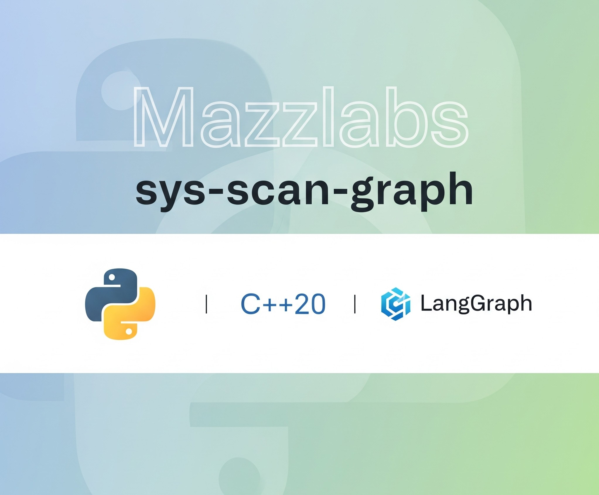
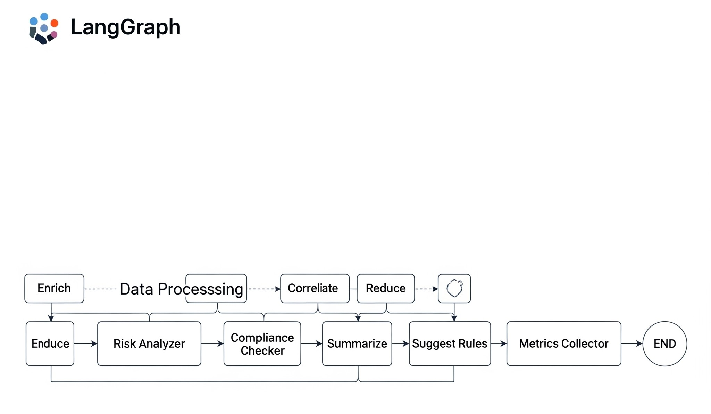

<!-- REWRITTEN README (2025) -->
# sys-scan-graph

<div align="center">
  
</div>
## System Security Scanner & Intelligence Graph
**Sys-Scan-Graph**: is a high-speed security analysis tool that transforms raw data from multiple security surfaces into a unified, actionable report.

It combines a high-performance C++ scanning engine with a Python-based intelligence layer to deliver deterministic, reproducible results. The core engine gathers data and outputs it in multiple formats (JSON, NDJSON, SARIF, HTML). This report is then ingested by a robust LangGraph agent that analyzes, organizes, and enriches the findings, providing deep insights with unprecedented speed.

 -   Core Engine: Blazing-fast and deterministic scanning built in C++.

 -   Intelligence Layer: Advanced analysis and enrichment powered by Python and LangGraph.

 -   Unified Reporting: Get a single, clear report in the format you need.


**Repository Origin**: This is a proprietary fork of the open-source [`J-mazz/sys-scan`](https://github.com/J-mazz/sys-scan) repository. The core C++20 scanner is based on the MIT-licensed original, but this fork includes proprietary enhancements and the Intelligence Layer.


Key design pillars:
* High‑signal, low‑noise findings (aggregation & baseline downgrades)
* Deterministic, canonical JSON suitable for hashing, gating & attestations
* Lightweight build (no heavy runtime deps) and fast execution
* Extensibility via a rules layer and optional Python LangGraph enrichment

It targets Debian/Ubuntu (but aims to stay broadly portable) and is designed to slot cleanly into CI pipelines, fleet hygiene jobs, or local investigative use. Contributions that improve signal quality, determinism, or performance are welcome.

---

## Table of Contents
1. Quick Start
2. Feature Highlights
3. Core Scanners
4. Output & Formats
5. Rules Engine
6. High-Level Architecture
7. Core Scanner Capabilities (OSS)
8. LLM Provider Architecture
9. Performance Baseline & Regression Detection
10. Roadmap & Ideas
11. License & Usage
12. Intelligence Layer Pipeline / DAG
13. LangGraph Orchestration & Cyclical Reasoning
14. Risk & Probability Model
15. Baseline, Rarity & Process Novelty
16. Correlation & Rule Engine
17. Compliance & Gap Normalization
18. ATT&CK Coverage & Causal Hypotheses
19. Follow-Ups, Trust & Policy Enforcement
20. Performance, Determinism & Manifest
21. Data Governance & Redaction
22. Fleet & Rarity Reporting
23. CLI Highlights
24. Extensibility Guides
25. Versioning & Roadmap
26. License

---
## 1. Quick Start (Core)

```bash
git clone https://github.com/Mazzlabs/sys-scan-graph.git
cd sys-scan-graph
cmake -B build -S . -DCMAKE_BUILD_TYPE=Release
cmake --build build -j$(nproc)
./build/sys-scan --canonical --modules-summary --min-severity info > report.json
```
Stable hash (canonical mode + optional time zero):
```bash
SYS_SCAN_CANON_TIME_ZERO=1 ./build/sys-scan --canonical > canon.json
sha256sum canon.json
```

NDJSON stream (grep only findings):
```bash
./build/sys-scan --ndjson | grep '"type":"finding"'
```

---
## 2. Quick Start (Intelligence Layer)
* Optional multi-standard compliance assessment (PCI DSS 4.0, HIPAA Security Rule, NIST CSF 2.0) with summarized pass/fail/score metrics (Core emits structured compliance_summary).
* Gap analysis mode producing focused `compliance_gaps` with remediation hints & normalized severities (Core + Intelligence Layer enrichment).
* Optional LangGraph-based enrichment DAG (checkpointing, schema validation, time‑series indexing, baseline rarity & novelty scoring, correlations, LLM-governed summarization, HTML + diff artifacts).
* Fast: avoids expensive full file reads (bounded hashing window, selective parsing).

---
## 3. Core Scanners
| Scanner | Focus | Notable Signals |
|---------|-------|-----------------|
| Process | Userland processes | Deleted executables, temp exec, env LD anomalies, executable hashing (opt) |
| Network | TCP/UDP sockets | Listening exposure, high fan‑out heuristics (planned) |
| Kernel Params | sysctl / /proc | Insecure kernel tunables (planned extensions) |
| Kernel Modules | Loaded & filesystem state | Unsigned, out‑of‑tree, missing file, hidden vs sysfs, compressed .ko scan |
| World Writable | Directories & files | Writable risk surfaces & path hijack potential |
| SUID/SGID | Privileged binaries | Unexpected SUID set, baseline expected set downgrade |
| IOC | Execution context | ld.so.preload abuse, deleted binaries, env risk aggregation, eBPF exec trace |
| MAC | SELinux/AppArmor status | Missing MAC, downgrade logic if one present |
| Compliance (opt) | PCI / HIPAA / NIST CSF controls | Pass/fail aggregation + gap analysis (when enabled) |
| Integrity (opt) | Future pkg/IMA | Placeholders for package/package integrity future hook |
| Rules | Post-processing layer | MITRE tagging, severity escalation |

---
## 4. Output & Formats
Base JSON always contains:
* `meta` – environment + provenance.
* `summary` – dual counts, severities, timings, slowest scanner.
* `results[]` – per-scanner groups.
* `collection_warnings[]` & `scanner_errors[]` – non-fatal diagnostics.
* `summary_extension` – extended scoring (total & emitted risk).

Optional:
* `--canonical` enforces deterministic ordering & minimal whitespace (RFC8785 style stabilization).
* `--ndjson` streams: meta, summary_extension, each finding (easy piping).
* `--sarif` produces SARIF for code scanning ingestion.

---
## 5. Rules Engine
Capabilities:
* Declarative rule files (`.rule`) with `rule_version` guard.
* AND/OR logic; equality, regex (`~=`), substring future extension.
* MITRE technique aggregation (order‑preserving de‑dup).
* Severity override & notes.
* Structured warnings on invalid/legacy versions (non‑fatal unless gated).

Example:
```
rule_version = 1

rule "Escalate deleted suspicious binary" {
	when {
Runtime overrides via env (`SYS_SCAN_PROV_*`) or `--slsa-level`. Deterministic canonical mode + optional timestamp zeroing yields stable hashes for attestations or artifact promotion.

SYS_SCAN_CANON_TIME_ZERO=1 ./build/sys-scan --canonical > r.json
sha256sum r.json
```
Generate provenance env file:
```bash
python -m venv agent/.venv
source agent/.venv/bin/activate
pip install -r agent/requirements.txt
./build/sys-scan --canonical --output report.json
python -m agent.cli analyze --report report.json --out enriched_report.json \
	--checkpoint-dir checkpoints --index-dir runs --schema schema/v2.json
jq '.summaries.attack_coverage.technique_count' enriched_report.json
```
Generate HTML + diff (enable in `config.yaml` then run two scans with `--prev`):
```bash
python -m agent.cli analyze --report report.json --out enriched_v2.json --prev enriched_report.json
```

Fleet & rarity artifacts:
```bash
python -m agent.cli rarity-generate-cmd
python -m agent.cli fleet-report --out fleet_report.json
```

---
## 6. High‑Level Architecture

<div align="center">
  
</div>

```
					+-------------------------+
					|    Core Scanner (C++)   |
					|  scanners -> Report v2  |
					+------------+------------+
											 |
											 v (JSON, deterministic)
					+------------+------------+
					| Intelligence Layer      |
					| (Python / LangGraph)    |
					+------------+------------+
	 load -> augment -> correlate -> baseline/rarity ->
	 novelty -> seq & multi-host -> drift -> reduce ->
	 followups -> actions -> summarize -> output (canonical)
```
Core responsibilities: collection, minimal transformation, canonicalization, reproducibility.

Intelligence Layer adds: enrichment, multi-signal correlation, temporal & cross-host analytics, calibrated risk & probability, summarization (LLM‑optional), ATT&CK coverage, compliance gap normalization, performance telemetry, deterministic output ordering.

---
## 7. Core Scanner Capabilities (OSS)
| Scanner | Key Signals |
|---------|-------------|
| process | Deleted / temp execs, SUID in home, hashed executables (opt) |
| network | Listening sockets, metadata normalization, future exposure heuristics |
| kernel_params | Selected hardening/sysctl posture |
| modules | Unsigned / out‑of‑tree, compressed KO analysis, summary aggregation |
| world_writable | Writable risk surfaces & hijack vectors |
| suid | Unexpected privileged binaries, baseline-friendly identifiers |
| ioc | ld.so.preload, suspicious env, deleted binary exec contexts |
| mac | SELinux/AppArmor presence / gaps |
| compliance (opt) | Multi-standard pass/fail & gap scaffolding |
| integrity (placeholder) | File/package integrity future hook |
| rules | Optional severity/tag post-processing (open-core rule format) |

Output includes: `meta`, `summary`, `results[]`, `collection_warnings[]`, `scanner_errors[]`, `summary_extension` (risk sums). Canonical mode produces stable RFC8785-like ordering for hashing & attestation.

`collection_warnings` structure (v2 schema compatible):
* New format (preferred): `{ "scanner": "modules", "code": "decompress_fail", "detail": "/lib/modules/..." }`
* Legacy format (still accepted): `{ "scanner": "modules", "message": "decompress_fail:/lib/modules/..." }`

The schema (`schema/v2.json`) was updated with a `oneOf` to allow both so downstream tooling can migrate gradually. When both `code` and `message` forms are absent or mixed, the entry is invalid. Future enriched / agent layers should normalize to the new form.

Key capabilities powered or exposed via the LangGraph mode:
* Explicit DAG stages: load → validate (schema) → augment → correlate → baseline rarity → reduce → summarize (LLM‑gated) → actions → output.
* Per‑node checkpointing (`--checkpoint-dir`) writes JSON snapshots of evolving agent state for audit & troubleshooting.
* Schema validation stage (optional `--schema schema/v2.json`) adds structured collection warning if validation fails.
* Time‑series indexing (`--index-dir`) appends lightweight entries (scan_id, host_id, counts, correlation/action totals) enabling trend dashboards.
* Baseline rarity & anomaly scoring (SQLite) with process novelty (embedding‑like feature vectors) adjusting risk subscores deterministically.
* Temporal sequence correlation (e.g. new SUID then IP forwarding) and rule‑driven multi‑finding correlations with back‑references.
* Compliance summary & gap ingestion from core JSON with remediation hint enrichment & severity normalization.
* Performance instrumentation (durations, counters) + regression detection vs rolling baseline persisted to `artifacts/perf_baseline.json`.
* Risk summarization gate: skips LLM summarization when aggregate medium+ risk sum below threshold and no new findings (cost control / determinism).
* Data governance redaction layer scrubs sensitive metadata before any LLM provider call (provider pluggable via env `AGENT_LLM_PROVIDER`).
* Token accounting & estimated cost snapshot recorded in enriched output (`token_accounting`).
* ATT&CK technique coverage derivation from tag → technique mapping (`attack_mapping.yaml`).
* Deterministic canonicalization of enriched output for reproducible hashing / diffs.
* HTML dashboard + Markdown diff generation (if enabled in config).

Quick start (after building core scanner):
```bash
python -m venv agent/.venv
source agent/.venv/bin/activate
pip install -r agent/requirements.txt
./build/sys-scan --canonical --output report.json
python -m agent.cli analyze --report report.json --out enriched_report.json \
	--checkpoint-dir checkpoints --index-dir enriched_index --schema schema/v2.json
ls checkpoints  # per-stage snapshots
jq '.summaries.metrics | {correlations, "perf.total_ms": ."perf.total_ms"}' enriched_report.json
```

Notable flags (agent `analyze` command):
* `--checkpoint-dir DIR` – write per-node state snapshots.
* `--schema PATH` – validate raw report against JSON Schema (adds warning on failure).
* `--index-dir DIR` – append run metadata entries (time‑series index.json).
* `--prev FILE` – generate diff markdown & notification heuristics.

Environment knobs:
* `AGENT_BASELINE_DB` – alternate SQLite path for baseline rarity.
* `AGENT_LLM_PROVIDER` – select summarization backend (or omit for deterministic skip).
* `AGENT_MAX_REPORT_MB` – ingestion size guard (default 5MB).
* `AGENT_PERF_REGRESSION_PCT` – performance regression threshold (default 30%).
* `AGENT_LOAD_HF_CORPUS=1` – opt‑in external corpus metrics enrichment (if deps available).

### LLM Provider Architecture (Async-Safe Fallback Chain)
The enhanced LLM layer (`agent/llm_provider.py`) implements a multi-provider fallback chain (LangChain/OpenAI/Anthropic/null) with:
* Synchronous public API (pipeline remains sync) while safely executing async provider methods.
* Event‑loop detection: if no loop is running we `asyncio.run` the coroutine; if a loop is already active (e.g. inside LangGraph) we spin up a lightweight helper thread with its own loop to await the coroutine (avoids nested `asyncio.run` errors).
* Fallback + retry logic: each operation (summarize / refine_rules / triage) reselects the highest priority available provider; failures prune that provider and continue until success or exhaustion (then null provider is used).
* Transparent caching keyed on serialized arguments to short‑circuit duplicate summarize calls.
* Metrics: counts of calls, fallbacks, cache hits, token usage (if provider emits token metrics) exposed via `get_metrics()`.
* Deterministic behavior when no external provider is configured (null provider returns a structured summary with zero tokens & latency).

Implementation Notes:
* The previous design used nested `asyncio.run`, which can deadlock or raise when invoked under an existing loop. The refactor introduced `_run_coro_blocking` and `_execute_with_fallback_sync` eliminating that risk.
* Providers may expose either sync or async methods; the wrapper normalizes them so the pipeline does not need `await`.
* You can extend providers by adding a new initializer in `_initialize_providers` and updating operation priority lists in `_select_provider`.

### Performance Baseline & Regression Detection
`MetricsCollector` adds lightweight perf tracking:
* `snapshot()` – capture current counters and durations.
* `save_baseline(path, snapshot)` / `load_baseline(path)` – persist / retrieve JSON (directory auto-created).
* `compare_to_baseline(current, baseline, threshold)` – compute per-stage regressions (list values averaged) where `current > baseline * (1 + threshold)`.
* Output assembly records regression count + slowest stage summary (`perf.regression_count`, `perf.slowest_ms`).

Use this to fail CI on unexpected slowdowns without altering functional output determinism.

All enrichment logic is additive; the Core scanner output format is not modified. If you only need raw deterministic scanning, ignore `agent/` entirely.

---
## 10. Roadmap & Ideas
See also inline comments / issues. Near‑term concepts:
* Extended risk scoring calibrations.
* Package integrity (dpkg/rpm verify) & mismatch aggregation.
* Landlock / chroot sandbox addition.
* Enhanced network exposure heuristics & fan‑out thresholds.
* Additional output signing backends (cosign, age).

----
## 11. License & Usage

**Important Licensing Clarification:**

This repository (`Mazzlabs/sys-scan-graph`) is a **proprietary fork** and does **NOT** carry an MIT license. It is based on the original open-source repository [`J-mazz/sys-scan`](https://github.com/J-mazz/sys-scan) which is MIT-licensed.

### Licensing Structure

- **Core Scanner (C++20)**: Based on the MIT-licensed `J-mazz/sys-scan` repository, but this fork includes proprietary modifications and enhancements
- **Intelligence Layer (`agent/` directory)**: Proprietary restricted license - internal evaluation only
- **This Repository**: No MIT license applies - proprietary license governs the entire codebase

### Usage Rights

- **Internal Use**: Permitted for evaluation and internal operations
- **Redistribution**: Requires separate commercial agreement
- **Commercial Use**: Contact Joseph@Mazzlabs.works for licensing terms

See `LICENSE` file for complete licensing details and restrictions.

Parallel execution: pass `--parallel` (and optionally `--parallel-threads N`) to run scanners concurrently. Ordering & timing records remain deterministic: starts are emitted in registration order, findings appended under a mutex, and completions normalized so final JSON ordering matches the sequential baseline.

---
## 12. Intelligence Layer Pipeline / DAG
Sequential `pipeline.py` and DAG `graph_pipeline.py` implement these deterministic stages:
1. Load / Validate (size & UTF‑8 guards, JSON schema optional)  
2. Augment (host_id derivation, scan_id, tagging, host role classification, initial risk_subscores)  
3. Correlate (rule engine: exposure bonus, predicate hit tracking, external knowledge tagging)  
4. Baseline Rarity (SQLite: new / recent / common, anomaly weighting, calibration observation logging)  
5. Process Novelty (lightweight embedding, cosine distance clustering, anomaly boost)  
6. Sequence Correlation (temporal heuristics e.g. new SUID -> IP forwarding)  
7. Metric Drift & Synthetic Findings (z-score + early delta heuristics)  
8. Multi‑Host Correlation (simultaneous module emergence)  
9. Reduction (module / SUID / network summaries & top risk slice, redaction applied)  
10. Follow-Ups (deterministic tool plan: hash + package manager query) & Trust Downgrade  
11. Actions (priority recommendations from correlations & reductions)  
12. Summarize (LLM provider optional, risk gate to skip cost)  
13. ATT&CK Coverage & Causal Hypotheses  
14. Performance Snapshot & Regression Detection  
15. Canonicalized Enriched Output assembly (stable ordering)  

All transformations are local & deterministic given identical inputs, weights, calibration and rule pack.

---
## 13. LangGraph Orchestration & Cyclical Reasoning
The LangGraph workflow implements a bounded baseline enrichment iteration followed by optional rule suggestion:
* Active baseline enrichment loop: summarize -> (if any enriched finding lacks baseline_status) plan_baseline -> baseline_tools -> integrate_baseline -> summarize.
* Iteration guard: `AGENT_MAX_SUMMARY_ITERS` (default 3) limits summarize passes; each pass increments `iteration_count`.
* Single baseline cycle: `baseline_cycle_done` flag ensures the baseline tool loop executes at most once even if findings still lack context, preserving determinism.
* Conditional routing: `choose_post_summarize` directs flow either back into baseline planning or to `suggest_rules` (gap mining) using severity heuristics.
* Tool execution: baseline queries expressed as structured tool_calls executed via ToolNode; results merged deterministically into `baseline_results`.
* Deterministic safeguards: no stochastic sampling; iteration cap + flag prevent unbounded loops; output reproducible under identical inputs and environment variables.

Loop pattern when baseline context is required:
```
enrich -> summarize -> plan_baseline -> baseline_tools -> integrate_baseline -> summarize -> suggest_rules -> END
```
Fast path (no baseline needed): `enrich -> summarize -> suggest_rules -> END`.

---
## 14. Risk & Probability Model
Risk subscores: impact, exposure, anomaly, confidence. Composite:
```
raw = impact*W_i + exposure*W_e + anomaly*W_a
scaled = (raw / max_raw) * 100 * confidence -> int 0..100
```
Weights: persistent JSON (`agent_risk_weights.json`) or env overrides. Logistic calibration (`agent_risk_calibration.json`) maps raw weighted sum to `probability_actionable`.
CLI helpers: `risk-weights`, `risk-calibration`, `risk-decision` (analyst feedback to calibration table).

---
## 15. Baseline, Rarity & Process Novelty
SQLite schema tracks: finding first_seen & counts, module presence per host, per-scan metrics (drift analysis), calibration observations, process clusters (vector sums), EWMA metrics.
Rarity file (`rarity.yaml`) produced via `rarity-generate-cmd` encodes fleet-wide module rarity scores feeding module reduction stats.
Process novelty: deterministic 32-dim token hashed embedding + cosine distance; far vectors escalate anomaly (bounded by caps) & attach rationale.

---
## 16. Correlation & Rule Engine
Rule merge order: user rule dirs (from config) first, then default in-repo rules, dedup by id (first wins). Conditions support field and metadata matching, ANY/ALL logic, exposure bonus (unique exposure tags). Predicate hit map recorded for explainability. Additional synthetic correlations: sequence anomalies, multi-host module propagation.

---
## 17. Compliance & Gap Normalization
Raw core may include `compliance_summary` and `compliance_gaps`. Intelligence Layer: severity normalization, remediation hint enrichment (knowledge map), metrics export (`compliance_gap_count`).

---
## 18. ATT&CK Coverage & Causal Hypotheses
Tag→Tech mapping (`agent/attack_mapping.yaml`) aggregated into coverage metrics: technique_count, techniques[], tag_hits{}. Heuristic causal hypotheses derived from correlation tags (`sequence_anomaly`, `module_propagation`, `metric_drift` + routing) – all marked speculative/low confidence.

---
## 19. Follow‑Ups, Trust & Policy Enforcement
Deterministic follow-ups executed for selected findings (hash + package manager query). Trusted binary hashes (knowledge manifest) can downgrade severity & adjust rationale. Policy layer escalates severity for executables outside approved directories and tags denied paths.

---
## 20. Performance, Determinism & Manifest
Every stage timed & counted; snapshot saved & compared to prior baseline (regression threshold env-configurable). Manifest (`manifest.json`) includes version, rule_pack_sha, weights, embedding_model_hash. Enriched output is canonicalized (sorted keys + stable ordering of arrays) to minimize diff noise.

---
## 21. Data Governance & Redaction
Redaction rules sanitize filesystem/user-identifying substrings. LLM summarization gated by risk threshold and redacted objects only. Token & estimated cost accounting embedded (`summaries.metrics`). Optional corpus insights (when `AGENT_LOAD_HF_CORPUS=1`) add high-level row counts & schema fingerprints (hashed column sets only).

---
## 22. Fleet & Rarity Reporting
`fleet-report` aggregates: outlier hosts (z-score of finding.count.total), newly common modules (simultaneous first_seen), risk distribution histogram. Rarity generation uses module observation host counts to compute rarity scores consumed by reductions.

---
## 23. CLI Highlights
Core (scanner): see `--help` for full list. Common:
```
./build/sys-scan --canonical --min-severity low --fail-on high
./build/sys-scan --ndjson --modules-summary
```
Agent:
```
python -m agent.cli analyze --report report.json --graph --checkpoint-dir ckpt
python -m agent.cli risk-weights --show
python -m agent.cli risk-calibration --show
python -m agent.cli fleet-report
python -m agent.cli rule-gap-mine --dir enriched_history --refine
python -m agent.cli keygen --out-dir keys
python -m agent.cli sign --report report.json --signing-key keys/agent.sk
python -m agent.cli verify --report report.json --verify-key keys/agent.vk
```

---
## 24. Extensibility Guides
| Extension | How |
|-----------|-----|
| New Scanner | Add C++ implementation, register in `ScannerRegistry`, maintain deterministic order |
| New Rule Pack | Place YAML/JSON in rule dir; reference path in `config.yaml` |
| New Correlation Heuristic | Add stage or augment existing correlation logic (ensure deterministic ordering & bounded size) |
| New Knowledge Pack | Add YAML under `agent/knowledge` (ports/modules/suid/orgs) |
| New Follow-Up Tool | Implement deterministic executor returning JSON; add to follow-up plan builder |
| New Summaries Field | Extend `Summaries` model; preserve backwards compatibility (additive) |

Testing: minimal unit tests under `agent/tests/` demonstrate fuzzing & pipeline invariants (metric drift, rule scoring). Keep additions deterministic (avoid wall-clock except through provided time abstraction) for reproducible output.

---
## 25. Versioning & Roadmap
Schema: current core schema major = `2`. Increments only on breaking structural changes. Intelligence Layer output version header: `EnrichedOutput.version` (currently `agent_mvp_1`).

Roadmap (abridged):
* Cyclical reasoning activation (bounded LangGraph loop for adaptive rule refinement).
* Expanded ATT&CK mapping & coverage deltas across time-series index.
* Package integrity & SBOM correlation (dpkg/rpm verify integration).
* eBPF short-lived process trace & correlation.
* Expanded compliance control libraries with machine-readable remediation catalogs.
* Alternative signing backends (cosign/age) & build attestation format integration.

---
## 26. License

**Proprietary Repository Notice:**

This repository (`Mazzlabs/sys-scan-graph`) is a proprietary fork of the open-source [`J-mazz/sys-scan`](https://github.com/J-mazz/sys-scan) repository. **No MIT license applies to this repository.**

### Repository Licensing

- **This Fork**: Proprietary license - see `LICENSE` file for complete terms
- **Original Source**: Based on MIT-licensed `J-mazz/sys-scan` repository
- **Core Scanner**: Proprietary modifications to the original MIT-licensed core
- **Intelligence Layer**: Proprietary restricted license

### Usage Terms

- Internal evaluation and operation permitted
- Redistribution, SaaS, or commercialization requires separate agreement
- Contact: Joseph@Mazzlabs.works for commercial licensing

See `LICENSE` file for detailed licensing terms and restrictions.

---
## Support / Questions
Open issues for bugs or design proposals (tag `design`). Security concerns: follow responsible disclosure guidelines (see `SECURITY.md`).

---
## At a Glance (Cheat Sheet)
| Need | Command |
|------|---------|
| Raw deterministic scan | `./build/sys-scan --canonical > report.json` |
| Enrich & summarize | `python -m agent.cli analyze --report report.json --graph --out enriched.json` |
| HTML + diff | Enable in `config.yaml`; rerun with `--prev` |
| Update weights | `python -m agent.cli risk-weights --impact 6 --show` |
| Calibrate logistic params | `python -m agent.cli risk-calibration --a -2.5 --b 0.18` |
| Generate rarity file | `python -m agent.cli rarity-generate-cmd` |
| Fleet report | `python -m agent.cli fleet-report` |
| Rule gap mining | `python -m agent.cli rule-gap-mine --dir history --refine` |
| Sign & verify | `python -m agent.cli keygen && python -m agent.cli sign --report report.json --signing-key keys/agent.sk && python -m agent.cli verify --report report.json --verify-key keys/agent.vk` |

---
_End of README_

cmake -B build -S . -DCMAKE_BUILD_TYPE=Release -DBUILD_TESTS=ON
cmake --build build -j$(nproc)
./build/sys-scan --help
```

## Testing
```
cd build
ctest --output-on-failure
```
Key tests:
* `canonical_golden` – regression guard for canonical stable hash
* `ndjson_mitre` – MITRE technique formatting in NDJSON
* `rules_*` – rule engine multi-condition, version, warnings, MITRE de‑dup
* `meta_suppression` – metadata privacy flags honor suppression
* `canonical_golden` – also guards provenance field stability (hash updates only on intentional schema or provenance additions)

## Result Integrity & Provenance

Canonical JSON (`--canonical`) plus deterministic ordering (& optional `SYS_SCAN_CANON_TIME_ZERO=1`) enables stable hashing of reports. To attest integrity you can:
Provenance override environment variables (if set, override embedded build constants): `SYS_SCAN_PROV_GIT_COMMIT`, `SYS_SCAN_PROV_COMPILER_ID`, `SYS_SCAN_PROV_COMPILER_VERSION`, `SYS_SCAN_PROV_CXX_STANDARD`, `SYS_SCAN_PROV_CXX_FLAGS`, `SYS_SCAN_PROV_SLSA_LEVEL`, `SYS_SCAN_PROV_BUILD_TYPE`.

1. Produce report: `./build/sys-scan --canonical --output report.json`
2. (Optional) Zero timestamps for fully reproducible hash: `SYS_SCAN_CANON_TIME_ZERO=1 ./build/sys-scan --canonical --output report.json`
3. Sign with GPG: `./build/sys-scan --canonical --output report.json --sign-gpg <KEYID>` (emits `report.json.asc` detached signature)

The `meta.provenance` object embeds build metadata for supply‑chain transparency:
```
"provenance": {
	"git_commit": "<short-hash>",
	"compiler_id": "GNU|Clang|...",
	"compiler_version": "<ver>",
	"cxx_standard": "20",
	"cxx_flags": "<merged flags>",
	"slsa_level": "<declared level>",
	"build_type": "Release|Debug"
}
```
Runtime override: `--slsa-level` (or env `SYS_SCAN_SLSA_LEVEL_RUNTIME`) if you want to declare an attested SLSA build level at execution time.

### Reproducible Builds

The project avoids embedding volatile timestamps (unless you rely on external libraries that do so). For stricter reproducibility:

Recommended invocation:
```
cmake -B build -S . -DCMAKE_BUILD_TYPE=Release \
	-DSYS_SCAN_REPRO_BUILD=ON -DSYS_SCAN_SLSA_LEVEL=1 \
	-DCMAKE_CXX_FLAGS_RELEASE="-O2 -g0 -ffile-prefix-map=$(pwd)=. -fdebug-prefix-map=$(pwd)=."
cmake --build build -j$(nproc)
SOURCE_DATE_EPOCH=1700000000 SYS_SCAN_CANON_TIME_ZERO=1 ./build/sys-scan --canonical --output report.json
sha256sum report.json
```
Notes:
* `SYS_SCAN_REPRO_BUILD=ON` scrubs `__DATE__/__TIME__` and marks build reproducible.
* `SYS_SCAN_CANON_TIME_ZERO=1` normalizes all timestamps to epoch and sets `meta.normalized_time=true`.
* Use toolchain packaged compilers for determinism; ensure locale + TZ stable (e.g. `LC_ALL=C TZ=UTC`).
* Provide `--sign-gpg` to generate a detached signature after writing the file.

Future options may add cosign / age signing modes; current implementation focuses on ubiquitous GPG.

### Schema

The JSON Schema (`schema/v2.json`) explicitly enumerates dual metrics: `finding_count_total` vs `finding_count_emitted`, `severity_counts` vs `severity_counts_emitted`, and includes `emitted_risk_score` in `summary_extension` alongside `total_risk_score`. Additional properties remain open for forward compatibility; provenance and normalization flags (`meta.provenance`, `meta.normalized_time`) are permitted via `additionalProperties`.
## Roadmap Ideas
- Add hashing of binaries (optional OpenSSL/Blake3)
- Add package integrity checks (dpkg --verify)
 - Extract canonical IR structs (CanonVal) into shared header for potential external tooling
 - Additional SARIF properties (locations, partial fingerprints)

## Operational Tips
- Use `--modules-summary` to shrink report size in continuous runs.
- Combine `--min-severity medium` with `--fail-on high` in CI to gate only on stronger signals.
- Add benign path substrings to `--ioc-allow` (e.g. `/snap/,/flatpak/`) to reduce env IOC noise further.

## Roadmap (Short-Term)
Taint flags, numeric risk scoring, allowlist file (`--ioc-allow-file`), package integrity & systemd hardening checks, advanced MAC profiling.

## License
### Phase 10 Productization Demo
A quick end-to-end demonstration (two scans, enrichment, HTML generation, diff, manifest, timing):
```bash
./scripts/demo_phase10.sh
```
Outputs:
- report_demo_1.json / report_demo_2.json (raw C++ scanner outputs)
- enriched_demo_1.json / enriched_demo_2.json (Python agent enriched)
- enriched_report.html (static dashboard)
- enriched_diff.md (risk movement & new/removed findings)
- manifest.json (version, rule pack SHA, embedding model hash, weights)

<div align="center">
  
</div>
The script prints total wall time for two enrichment runs; single-run latency should target <1.5s on a modern laptop for typical host sizes.

