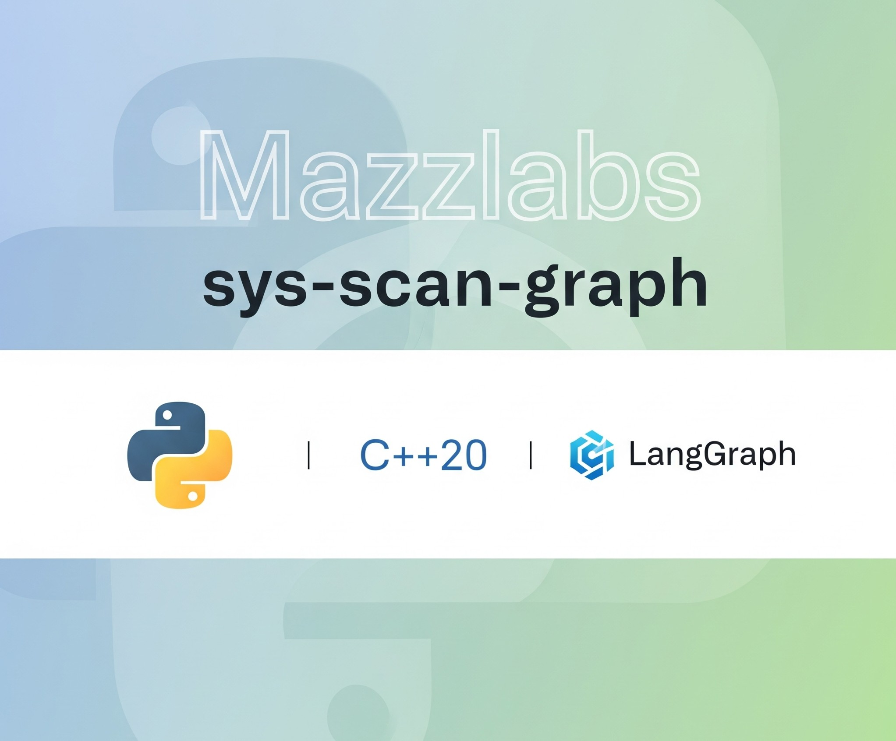

# sys-scan-graph

<div align="center">
  
</div>

## System Security Scanner & Intelligence Graph

**Sys-Scan-Graph** is a high-speed security analysis tool that transforms raw data from multiple security surfaces into a unified, actionable report.

<div align="center">
  <a href="https://codescene.io/projects/71206">
    
  </a>
  <a href="https://codescene.io/projects/71206">
    
  </a>
  <a href="https://codescene.io/projects/71206">
    
  </a>
</div>

This directory contains the optional **Python intelligence layer**, published as the `sys-scan-agent` package. It consumes JSON produced by the C++ core scanner and enriches/summarizes results locally.

### Key Features

- **Local-first analysis** of `sys-scan` JSON reports
- **CLI entry points** provided by the package (`sys-scan-graph`, `sys-scan-intelligence`)
- **Multiple output formats** including canonical JSON, NDJSON, SARIF, and self-contained HTML


---

## Quick Start

### Installation

The intelligence layer is installed separately from the C++ core.

```bash
python3 -m venv .venv
source .venv/bin/activate

pip install -U pip
pip install sys-scan-agent
```

Optional local-LLM dependencies:

```bash
pip install 'sys-scan-agent[ai]'
```

### Basic Usage

```bash
# Run the C++ core scanner (from the repo root)
./build/sys-scan --canonical --output report.json

# Analyze/enrich with the Python layer
source .venv/bin/activate
sys-scan-graph analyze --report report.json --out enriched_report.json
```

### Generate HTML Report

```bash
# Enable HTML generation in config.yaml, then run:
sys-scan-graph analyze --report report.json --out enriched_v4.json --prev enriched_report.json
```

---

## Documentation

For detailed documentation, see our [comprehensive wiki](../docs/wiki/_index.md):

- **[Architecture Overview](../docs/wiki/Architecture.md)** - High-level system architecture, core vs intelligence layer responsibilities
- **[Core Scanners](../docs/wiki/Core-Scanners.md)** - Scanner implementations, signals, output formats, and schemas
- **[Intelligence Layer](../docs/wiki/Intelligence-Layer.md)** - Pipeline stages, LangGraph orchestration, LLM providers, data governance

### Additional Resources

- **[Rules Engine](../docs/wiki/Rules-Engine.md)** - Rule file formats, MITRE aggregation, severity overrides, validation
- **[CLI Guide](../docs/wiki/CLI-Guide.md)** - Complete command reference
- **[Extensibility](../docs/wiki/Extensibility.md)** - Adding custom scanners and rules

---

## Repository Structure

This repository contains:

- **Core Scanner** (`src/`, `CMakeLists.txt`) - High-performance C++ scanning engine
- **Intelligence Layer** (`agent/`) - Python package (`sys-scan-agent`) for analysis and enrichment
- **Rules** (`rules/`) - Security rules and MITRE ATT&CK mappings
- **Documentation** (`docs/wiki/`) - Comprehensive project documentation
- **Tests** (`tests/`, `agent/tests/`) - Test suites for both components

---

## Key Design Principles

- **Type-safe architecture** with a C++23 toolchain using C++20 modules and dependency injection via ScanContext
- **Deterministic, reproducible results** with canonical JSON (RFC 8785 JCS) and stable ordering
- **Zero-trust security** with embedded LLM, capability dropping, and seccomp sandboxing
- **Thread-safe parallelization** with mutex-protected report aggregation
- **Extensible plugin system** supporting custom scanners, rules, and LLM providers
- **Comprehensive testing** via CTest (C++) and pytest (Python)

---

## Licensing

This project is licensed under the **Apache License 2.0**. See [`LICENSE`](../LICENSE) for complete licensing details.

---

## Support & Community

- **Documentation**: [Wiki](docs/wiki/_index.md) | [GitHub Wiki](https://github.com/J-mazz/sys-scan-graph/wiki)
- **Documentation**: [Wiki](../docs/wiki/_index.md) | [GitHub Wiki](https://github.com/J-mazz/sys-scan-graph/wiki)
- **Issues**: [GitHub Issues](https://github.com/J-mazz/sys-scan-graph/issues)
- **Discussions**: [GitHub Discussions](https://github.com/J-mazz/sys-scan-graph/discussions)
- **Security**: See [`SECURITY.md`](SECURITY.md) for vulnerability disclosure

---

<div align="center">
  
</div>

