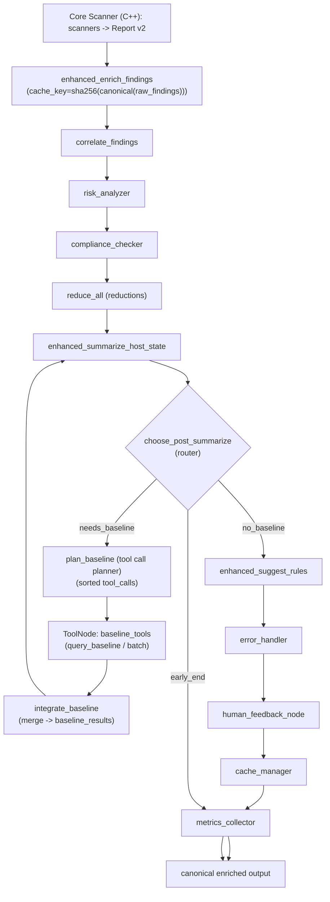

summarization & action generation.
- Each step includes: an observation, a detailed concrete solution (tasks, code targets, config), and verification criteria/tests to mark completion.

How to use this document
- Follow the phases in order. Each phase contains multiple numbered tasks. Complete tasks in sequence where dependencies exist.
- For each task, create a PR with incremental tests and documentation.
- This doc is intentionally prescriptive: file names, function names, and flags reflect the present repository layout (agent/graph.py, graph_nodes_*.py, agent/llm_provider.py, etc.)

Narrative: what I did and what follows
- I inspected the repository (LangGraph scaffolding, enhanced nodes, LLM provider abstractions, ToolNode usage, caching and metrics).
- Below I propose a multi-phase plan with explicit implementation tasks, test cases, and acceptance criteria. I'll produce one file here in the repo (this document). After you apply these steps, I can prepare PR templates, CI job config snippets, and example code patches.

---

Phases overview
1. Foundations: Robustness, determinism, and test coverage
2. Observability & metrics: per-node, baseline & regression detection
3. Performance & scalability: batching, DB connection pool, parallel nodes
4. LLM pipeline upgrade: provider orchestration, caching, prompt engineering, guardrails
5. Tooling & tool node maturity: deterministic ToolNode, tool contracts, test harness
6. Model-driven features: process novelty improvements, calibrated scoring, minimal learning loop
7. Safety, governance & redaction: structured redaction, guardrails, provable audit trail
8. MLOps & evaluation: datasets, metrics & continuous evaluation
9. Productization & operations: packaging, release, licensing clarity, demo pipelines
10. Launch readiness: privacy review, infra, runbooks, sample customers

Each phase broken into tasks below.

PHASE 1 — Foundations: Robustness & determinism
Observation
- The LangGraph workflow is feature-rich but has fragile import ordering and optional nodes. Determinism is central; missing tests for many node behaviors and race conditions.

Goals
- Harden module import/initialization, normalize GraphState shapes, and add deterministic unit/integration tests for core workflows.

Tasks

1.1 Stabilize GraphState and node contracts
- Observation: GraphState is a TypedDict with many optional keys; nodes sometimes assume presence.
- Solution:
  - Add a single canonical GraphState Pydantic schema (lightweight) used for validation at node boundaries.
  - Implement a helper `agent/graph_state.py` with `normalize_graph_state(state)` that ensures lists/dicts exist and sets default keys: `raw_findings: []`, `enriched_findings: []`, `correlations: []`, `metrics: {}`, `iteration_count: 0`, `baseline_cycle_done: False`, `cache_keys: []`, `start_time: None`.
  - Call `normalize_graph_state()` at each node entry (or via a decorator) to prevent None-handling scatter.
- Code targets:
  - file: `agent/graph_state.py`
  - modify `graph_nodes.py`, `graph_nodes_scaffold.py`, `graph_nodes_performance.py`, `graph_nodes_enhanced.py` to call the normalizer at start of each node.
- Verification:
  - Unit test `agent/tests/test_graphstate_normalize.py`: pass a partially-populated dict with None keys -> assert returned GraphState has mandatory keys and correct types.
  - Run existing agent tests; none should crash due to missing keys.

1.2 Add contract tests for router & baseline cycle
- Observation: `choose_post_summarize` has complex conditional branching; ensure behavior is deterministic and covered.
- Solution:
  - Write unit tests for `choose_post_summarize` covering these scenarios:
    - High-severity finding lacking baseline_status -> returns 'plan_baseline'
    - No high-severity findings -> returns END
    - baseline_cycle_done True -> never return plan_baseline
  - Test tool call ordering: `plan_baseline` must produce tool_calls sorted by `finding.id`.
- Code targets:
  - `agent/tests/test_router_and_baseline.py`
- Verification:
  - Tests pass and assert stable ordering (e.g., sort order preserved across reruns).

1.3 CI integration: unit tests and linters
- Observation: repo has many optional modules; CI coverage gaps exist.
- Solution:
  - Add a GitHub Actions workflow `ci-agent.yml` that:
    - Sets up Python (3.12).
    - Installs `-r agent/requirements.txt`.
    - Runs `pytest -q --maxfail=1 agent/tests`.
    - Runs flake8/isort or black check for agent code.
  - Ensure tests run in both `AGENT_GRAPH_MODE=enhanced` and baseline mode.
- Verification:
  - CI job runs and exits green locally and in PRs.

PHASE 2 — Observability & metrics
Observation
- There is `metrics_collector` and `MetricsCollector` but lacking standardized per-node metrics, traces, and correlation IDs.

Goals
- Provide per-node timings, counters, and unique invocation IDs; expose Prometheus-compatible telemetry and human-readable reports.

Tasks

2.1 Standardize node telemetry API
- Solution:
  - Create a node instrumentation helper `agent/metrics_node.py` with context manager `time_node(state, node_name)` that:
    - increments `metrics['node_calls'][node_name]`
    - appends duration to `metrics['node_durations'][node_name]` (list or EMA)
    - writes `last_node_ts` and `last_node_id` for traceability
  - Wrap each top-level node (enrich, summarize, correlate, plan_baseline, integrate_baseline, suggest_rules, etc.) with the `time_node` context manager.
- Verification:
  - Unit tests assert that calling nodes increments metrics and stores durations.

2.2 Export metrics (prometheus/pushgateway or JSON)
- Solution:
  - Add an exporter `agent/metrics_exporter.py`:
    - `export_prometheus(metrics)` (optional) and `write_metrics_json(state, path)`.
    - metrics JSON includes stage durations, cache_hits, baseline_queries_made, summarize_calls, llm_provider_calls, token_estimates, and final_metrics snapshot.
  - Add `--metrics-out PATH` CLI option to `agent/cli` analyze that writes metrics to disk after run.
- Verification:
  - Run `python -m agent.cli analyze --report report.json --metrics-out /tmp/m.json` -> file exists and contains expected keys.

2.3 Add sample dashboards & thresholds
- Solution:
  - Add `docs/metrics_dashboard.md` with recommended Prometheus/Grafana panels.
  - CI check: compare `perf_baseline.json` to current run; if regressions > `AGENT_PERF_REGRESSION_PCT`, fail with a clear message.
- Verification:
  - Simulate metric regression by altering a metric in test -> CI returns failure (in a test job).

PHASE 3 — Performance & scalability
Observation
- Some heavy operations (baseline queries, enrichment) can be parallelized or batched. There are placeholders for DB pool and async batching (`graph_nodes_performance.py`) but they need production-grade implementation & tests.

Goals
- Implement robust DB connection pool, batched baseline queries, and parallelized node execution with deterministic merge semantics.

Tasks

3.1 Implement and test SQLite connection pool
- Solution:
  - Extract the `DatabaseConnectionPool` in `agent/graph_nodes_performance.py` into `agent/db_pool.py` with:
    - Sane defaults, configurable max_connections via env `AGENT_DB_POOL_MAX=10`.
    - Safe `get_connection()` that returns a sqlite3 connection opened with `check_same_thread=False`.
    - Proper close_all on teardown.
  - Provide an async wrapper using `run_in_executor`.
- Verification:
  - Add unit test `agent/tests/test_db_pool.py` that spawns N concurrent baseline queries using `query_baseline_batch` against a temporary DB; assert no errors and all expected rows returned.

3.2 Batch baseline queries and results merging
- Solution:
  - Implement `query_baseline_batch` in `agent/graph_nodes_performance.py` to accept a list of findings and query DB via connection pool in batches (size `PERF_BATCH=100`).
  - Ensure returned baseline_results mapping is deterministic (sorted by finding_id).
- Verification:
  - Create integration test using sample enriched findings; assert baseline_results entries are correct and stable across repeated calls.

3.3 Parallelize non-dependent nodes
- Solution:
  - Introduce a controlled parallel executor for independent nodes (e.g., heavy enrichment of large numbers of findings -> split into shards, process in thread pool).
  - Implement a deterministic reduce step that merges results by sorting keys and deduplicating in a deterministic order.
- Verification:
  - Load a large synthetic report; run parallel path and sequential path and assert identical enriched output (bit-for-bit if canonicalization applied) or at least semantically identical (same findings, ordering rules) with tests `agent/tests/test_parallel_equivalence.py`.

3.4 Memory & streaming for summarization
- Solution:
  - Implement streaming summarization for very large findings sets by:
    - Chunking findings into `STREAM_CHUNK_SIZE` (configurable).
    - Running reductive summarization on each chunk and combining.
    - Updating `summarize_progress` in GraphState.
- Verification:
  - Simulate a large input and assert `summarize_progress` increments and final summary equals batch-summarized result.

PHASE 4 — LLM pipeline upgrade
Observation
- The repo has a pluggable LLM provider with a Null fallback and an enhanced provider. For SoTA we should improve prompt orchestration, dynamic context retrieval, retrieval-augmented generation (RAG) for knowledge packs and improve guardrails.

Goals
- Make summarization high-quality, low-cost, auditable and safe: incorporate retrieval augmentation, caching, prompt templates, structured outputs, and tool-safety guardrails.

Tasks

4.1 Stabilize provider interface and expand telemetry
- Solution:
  - Ensure `ILLMProvider` has well-documented method signatures in `agent/llm_provider.py`.
  - Extend providers to return structured `(Summaries, provider_metadata)` where `provider_metadata` includes token counts, model name, latency_ms, fallback=true/false, cached=true/false.
  - Update `get_enhanced_llm_provider()` to expose metrics and metrics export.
- Verification:
  - Unit tests for provider wrapper simulate provider successes and failures, check metadata fields present.

4.2 Add a Retrieval/Augmentation layer (RAG) for knowledge packs
- Observation: agent enriches findings from YAML knowledge files. Summaries can benefit from relevant context retrieval (local knowledge, historical baseline snippets).
- Solution:
  - Implement `agent/retriever.py`:
    - Provide `retrieve_context(finding, k=5)` that returns most relevant knowledge rows from `agent/knowledge/*` and optionally from `baseline.db` (first_seen snippets).
    - Use deterministic scoring (TF-IDF-lite or hashing overlap) to avoid external models.
  - At summarize time, include only redacted and relevant retrieved snippets as a structured `context` block to LLM.
  - Cache retrieval results keyed by finding identity hash.
- Verification:
  - Unit test where knowledge contains a matching module or port; summarizer receives the snippet and includes it in explanation_provenance.

4.3 Prompt templates, serialization and structured responses
- Solution:
  - Convert prompt builders to use templating and explicit "response schema" requirements.
  - Use a JSON-schema-like guard: ask models to produce a YAML/JSON object with fields `executive_summary`, `triage`, `actions[]` and `explanation_provenance`.
  - Implement `agent/guardrails.py` to validate returned structure, apply retry / secondary heuristics.
- Verification:
  - Unit tests that feed the LLM provider stub returning a malformed response -> guardrails retry and/or fallback to Null provider result.

4.4 Advanced caching & memoization
- Solution:
  - Add `agent/llm_cache.py` that caches summarize calls keyed on:
    - canonicalized reductions + correlation ids + baseline_context ids + provider_version + weights_sha
  - Cache entries store the Summaries and provider metadata. Add TTL and manual invalidation hooks (on weights change or rule pack update).
- Verification:
  - Test that repeated summarize calls with identical inputs are served from cache and that metrics show cache_hits incremented.

4.5 Cost & safety gate
- Solution:
  - Implement `summarize_gate(state)` that evaluates:
    - aggregated medium+ findings count and change since previous enriched report
    - total estimated token cost vs configured budget (AGENT_LLM_TOKEN_BUDGET)
    - If below threshold, use Null provider to synthesize deterministic summary.
- Verification:
  - Unit tests verifying that gate routes calls to Null provider under low materiality.

4.6 Prompt tuning & template A/B
- Solution:
  - Add `agent/prompt_templates/` with versioned templates; track template usage in metrics.
  - Implement an A/B toggler in CI to experiment with alternative templates and measure downstream metrics: human-rated summary usefulness, triage accuracy, action precision.
- Verification:
  - Run small A/B trials on fixtures; collect metrics and declare winner based on pre-defined KPIs.

PHASE 5 — Tooling maturity (ToolNode, tool contracts)
Observation
- ToolNode is central for baseline queries and follow-ups. Tool contracts must be deterministic and robust.

Goals
- Build deterministic tool harness, standard tool API, and test harness for tool execution.

Tasks

5.1 Standardize tool contract schema
- Solution:
  - Create a `spec/tool_contract.md` listing:
    - input: {tool_name, args: { ... }, request_id}
    - output: {tool_name, request_id, status: new|existing|error, payload: {finding_id, composite_hash, first_seen_ts, seen_count}, error_msg}
  - Implement an enforcement wrapper `agent/tool_wrapper.py` that validates outputs (schema) and converts to ToolMessages expected by LangGraph.
- Verification:
  - Unit tests for wrapper verifying schema conformance and deterministic field ordering.

5.2 Mocked tool harness for CI
- Solution:
  - Provide `agent/tests/tools/mock_tool_server.py` — a local stub that responds to tool calls deterministically based on a fixture DB.
  - Add tests that run the full graph with ToolNode using the mock tool server to exercise the baseline cycle.
- Verification:
  - Integration test `agent/tests/test_graph_with_toolnode.py` passes and `baseline_cycle_done` set true after the cycle.

PHASE 6 — Model-driven features & calibrated scoring
Observation
- Current scoring is heuristic with persistence. For SoTA, integrate lightweight learned calibrations and deterministic model improvements while preserving auditability.

Goals
- Use small supervised calibration models (logistic, small-tree) trained offline to map subscores to actionable probability; keep models lightweight and reproducible.

Tasks

6.1 Baseline dataset & offline training pipeline
- Solution:
  - Create `data/` fixtures containing labeled findings with `actionable: 0/1` derived from analyst decisions.
  - Implement offline training scripts under `agent/ml/train_calibration.py` to train logistic regression or isotonic calibration using stored risk_subscores.
  - Store model artifacts under `agent/models/calibration_v1.json` with model metadata and a sha256 manifest.
- Verification:
  - Unit test training pipeline with synthetic data; verify output model file and `calibration_version` bump.

6.2 Integrate calibrated scoring in pipeline
- Solution:
  - Load calibration model at start of agent; apply to each finding to set `probability_actionable`.
  - Update `risk-weights` CLI to allow model version selection and upload of new calibration artifacts.
- Verification:
  - Tests confirm `probability_actionable` computed and persisted in enriched output; track changes with `metrics`.

6.3 Feedback loop (analyst-in-the-loop)
- Solution:
  - Add a `risk_decision` CLI (exists) but extend it to:
    - Accept analyst label updates and record them in `baseline_db` or `feedback.db`.
    - Periodically retrain calibrations from feedback snapshots (offline).
- Verification:
  - End-to-end manual flow: analyst marks a finding as TP/FP -> stored -> retraining script picks up and updates model artifact.

PHASE 7 — Safety, governance & redaction
Observation
- Redaction placeholder exists but needs a robust, auditable governance layer to ensure privacy.

Goals
- Implement deterministic redaction rules with provenance and to support policy toggles (strict vs permissive).

Tasks

7.1 Redaction pipeline & policies
- Solution:
  - Implement `agent/redaction.py`:
    - Configure rules in YAML with regex and preserve masks.
    - Support policy levels: `none`, `standard`, `strict`.
    - For each redaction, append an audit entry to `state['agent_warnings']` with masked field & rule id.
- Verification:
  - Unit tests for redaction: ensure consistent masked outputs and audit entries.

7.2 LLM-safe wrappers & governance
- Solution:
  - Ensure `get_llm_provider()` always receives redacted content (enforce in `summarize` wrapper).
  - Log the pre- and post-redaction digests (hashes) into `enrichment_results.redaction_hashes` (for audit).
- Verification:
  - Tests verify LLM provider never receives raw PII fields when `policy` set to `standard`.

PHASE 8 — MLOps & evaluation
Observation
- No continuous evaluation or benchmark suite for summaries & action quality.

Goals
- Create an evaluation harness to measure summarization quality, triage precision, and action relevance (human and automated proxies).

Tasks

8.1 Ground-truth fixtures and evaluation metrics
- Solution:
  - Create `data/eval/` with curated enriched reports and human-labeled summaries and action items.
  - Implement `agent/eval/summarization_eval.py` to compute:
    - ROUGE / BERTScore (if available) vs ground truth
    - Action precision/recall (matching canonical action keys)
    - Calibration metrics: Brier score, ROC-AUC for probability_actionable vs labels
- Verification:
  - Run evaluation script and produce `eval_report.json` with metrics.

8.2 CI evaluation and model gating
- Solution:
  - Add CI job `agent-eval.yml` that runs evaluation on PRs that modify `agent/` or `prompt_templates`.
  - Fail gating if key KPIs degrade beyond thresholds (configured).
- Verification:
  - PR-based test demonstrates gating works; baseline metrics stored in `eval/baseline_metrics.json`.

PHASE 9 — Productization & operations
Observation
- To reach market readiness we need packaging, docs, support, and sample deployments.

Goals
- Create Docker images, Helm / systemd examples, pricing & licensing docs, runbooks and demo scripts.

Tasks

9.1 Packaging & deployment artifacts
- Solution:
  - Add `Dockerfile` for the agent (with pinned base image), multi-stage builds to keep image small.
  - Add systemd unit file `packaging/sys-scan-agent.service` and Helm chart skeleton `charts/sys-scan-agent/`.
- Verification:
  - Build Docker image, run locally, analyze logs and enriched output.

9.2 Runbooks & incident response
- Solution:
  - Write runbooks: `docs/runbooks/agent_deploy.md`, `docs/runbooks/incident_response.md`.
  - Include steps for key ops: rotate keys, update rule packs, re-train calibration, handle LLM provider outage.
- Verification:
  - Tabletop drill: simulate LLM outage and run through runbook steps.

PHASE 10 — Launch readiness & compliance
Observation
- Licensing is proprietary; productizing requires clear legal and security review.

Goals
- Finalize license text, security docs, SOC/pen-test plans, and demo-ready datasets.

Tasks

10.1 Legal & compliance
- Solution:
  - Update `LICENSE` to include explicit sections as described in README.
  - Add `SECURITY.md` and `PRIVACY.md` with guidance on data handling.
- Verification:
  - Legal review sign-off; repository badges show "proprietary".

10.2 Pen-test & performance audit
- Solution:
  - Run internal pen-test and performance test (use benchmark harness).
  - Collect results and remediate high severity.
- Verification:
  - Summary report and mitigation PRs closed.

---

Acceptance criteria and KPIs (example)
- Determinism: canonical enriched output stable across runs with same inputs and configuration (bit-for-bit where canonicalization applied).
- Quality: summarization ROUGE/BERTScore improves by X% over Null provider baseline; analyst satisfaction > 80% in pilot.
- Performance: typical host run summarization end-to-end < 1.5s for average host; scalable to fleet size N with batching.
- Reliability: baseline cycle deterministic; `baseline_cycle_done` reliably set; CI tests cover 95% of nodes.
- Security: all data redaction tests pass; no PII leakage to providers; LLM circuit breaker blocks calls after threshold.

---

Appendix: Example files to add (mermaid diagrams & test skeleton)
- I'll add two helpful files you can commit: a mermaid diagram file and a test skeleton for router behavior.
- Use the repository's code block format below to create them.

```markdown name=docs/LANGGRAPH_DIAGRAM.md
