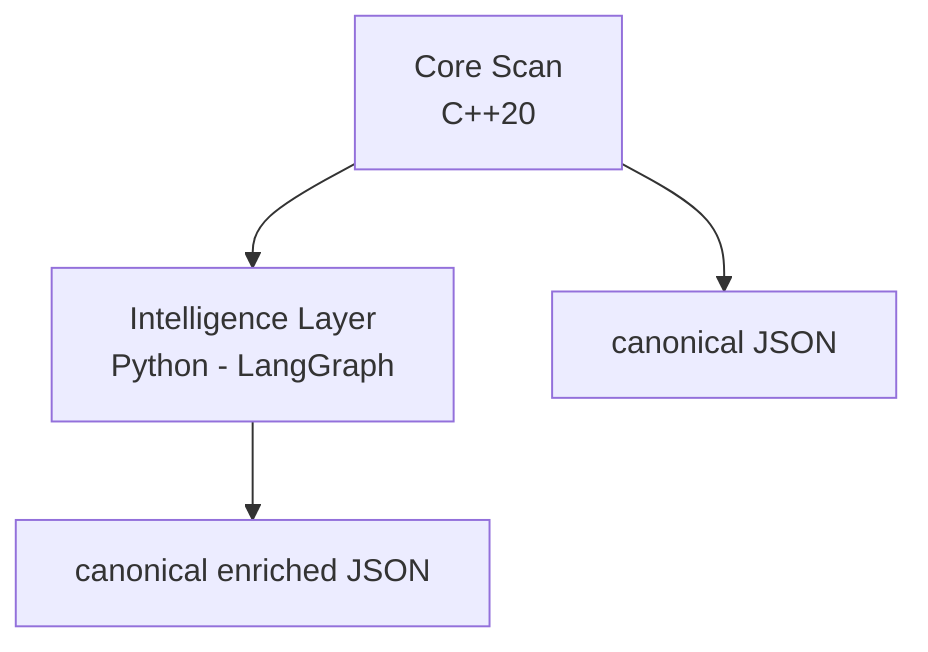
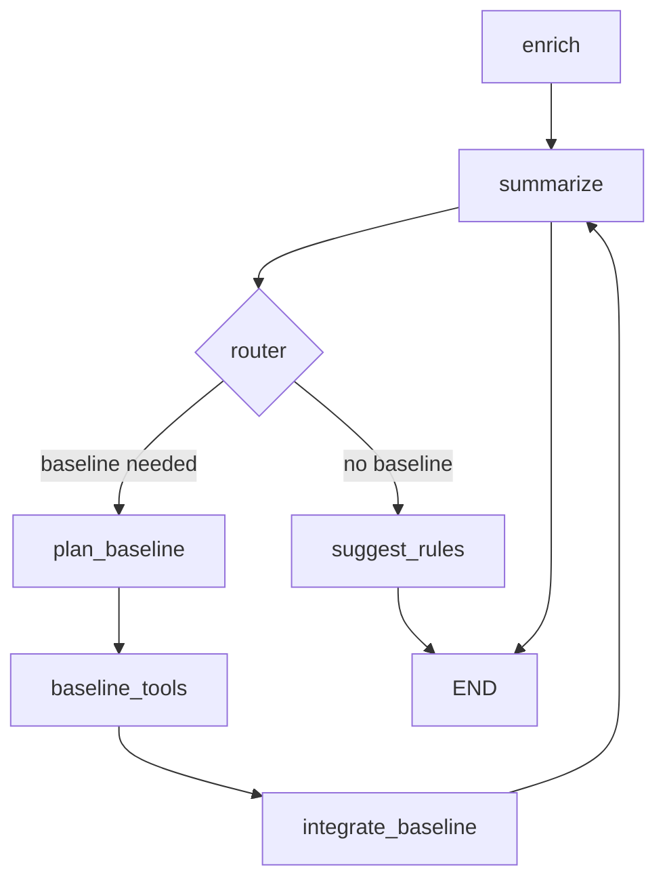

<!-- REWRITTEN ARCHITECTURE (2025) -->
# Architecture Overview

**sys-scan-graph** combines a high-performance C++20 scanning engine with an AI-powered intelligence layer to deliver comprehensive Linux system security analysis. The architecture emphasizes determinism, type safety, and zero-trust principles.

---

## System Design Philosophy

### Core Principles
- **Performance First**: C++20 core scanner optimized for minimal system impact
- **Type Safety**: Strict type-safe enums and modern dependency injection patterns
- **Zero-Trust AI**: Embedded fine-tuned Mistral-7B LLM requires no external API calls
- **Deterministic Output**: RFC 8785 canonical JSON ensures reproducible results
- **Comprehensive Coverage**: 16 specialized scanners across all security domains

### Two-Layer Architecture

```
┌─────────────────────────────────────────┐
│   C++20 Core Scanner (Open-Core)        │
│   • 16-17 specialized scanners          │
│   • Type-safe severity system           │
│   • Thread-safe parallel execution      │
│   • RFC 8785 canonical JSON output      │
└──────────────┬──────────────────────────┘
               ↓ report.json
┌──────────────────────────────────────────┐
│   Python Intelligence Layer              │
│   • Embedded Mistral-7B LLM (168MB)      │
│   • LangGraph workflow orchestration     │
│   • MITRE ATT&CK correlation             │
│   • Baseline anomaly detection           │
└──────────────┬──────────────────────────┘
               ↓ enriched_report.json
```

---

## Core Scanner Architecture

The C++20 scanning engine performs fast, deterministic security enumeration across 16 specialized domains:

**Security Domains Covered:**
- Process enumeration with behavioral analysis
- Network socket & listener detection
- Kernel hardening parameters
- Loaded kernel modules
- SUID/SGID binary tracking
- Indicators of Compromise (IOC)
- MAC policy status (SELinux/AppArmor)
- Filesystem security (world-writable, mount options)
- Container runtime awareness
- Systemd service analysis
- Audit daemon configuration
- File integrity monitoring
- eBPF execution tracing
- PCI DSS 4.0 compliance checks

**Key Features:**
- **Dependency Injection**: `ScanContext` pattern eliminates global state
- **Thread Safety**: Mutex-protected `Report` class enables parallel scanner execution
- **Type-Safe Severity**: Enum-based system (Info/Low/Medium/High/Critical/Error) with numeric risk scores
- **Rule Engine**: Multi-condition matching with regex support and MITRE technique tagging
- **Deterministic Ordering**: Fixed scanner registration order ensures consistent output diffs

---

## Intelligence Layer Architecture

The Python layer transforms raw scan data into actionable security intelligence using an embedded AI model trained on 2.5M security findings.

**Zero-Trust AI Implementation:**
- **Local LLM**: Mistral-7B-Instruct-v0.3 with LoRA adapters (168MB)
- **Training Dataset**: 2.5M unique security findings with multi-stage validation
- **No External APIs**: Complete offline operation ensures data sovereignty
- **Deterministic Inference**: Temperature=0.1 for reproducible analysis

**LangGraph Workflow Orchestration:**

Two operational modes provide flexibility for different use cases:

1. **Enhanced Workflow** (Full AI Analysis)
   - **enrich**: Package origins, CVE correlation, severity adjustments
   - **correlate**: Cross-finding patterns, attack path construction
   - **risk_analyzer**: Weighted scoring (rarity × severity × MITRE chaining)
   - **compliance_checker**: PCI DSS 4.0, HIPAA, NIST CSF 2.0 mapping
   - **summarize**: Executive summary with prioritized recommendations

2. **Baseline Workflow** (Fast Statistical Analysis)
   - Rapid analysis without LLM inference
   - Ideal for resource-constrained environments or benchmarking

**Baseline Intelligence:**
- **SQLite Database**: Historical frequency distributions for rarity scoring
- **Process Embeddings**: 32-dimensional behavioral feature vectors
- **DBSCAN Clustering**: Groups similar processes for anomaly detection
- **MITRE Correlation**: Maps findings to ATT&CK techniques via knowledge base

---

## Data Pipeline & Quality Assurance

**Training Data Integrity:**
The 2.5M training dataset undergoes rigorous validation to ensure high-quality, realistic security scenarios:

- **8 Specialized Producers**: Generate findings for each scanner type
- **3 Correlation Producers**: Create realistic cross-finding relationships
- **Multi-Stage Verification**: Schema compliance, coherence checks, realism constraints, diversity validation
- **MLOps Pipeline**: Complete infrastructure at [sys-scan-agent-MLops](https://github.com/Mazzlabs/sys-scan-agent-MLops)

---

## Output Formats & Integration

**Multiple Output Modes:**
- **JSON**: Default canonical format (RFC 8785 JCS)
- **NDJSON**: Streaming format for large datasets
- **SARIF**: Static Analysis Results Interchange Format for CI/CD integration
- **HTML**: Human-readable reports with visualizations

**Security Features:**
- GPG signing support for report integrity
- PII redaction capabilities
- Configurable severity thresholds
- Exit code mapping for CI/CD pipelines

---

## Testing & Quality

**Comprehensive Test Coverage:**
- **919 Total Test Cases** (698 C++, 221 Python)
- **C++ Suite**: Google Test framework with unit, integration, and compliance tests
- **Python Suite**: pytest with asyncio for workflow validation
- **Performance Benchmarks**: Continuous monitoring of scanner execution times
- **Canonical Golden Tests**: Bit-for-bit reproducibility validation

---

## Extensibility & Roadmap

**Current Extension Points:**
- New scanners via `Scanner` interface
- Custom rule packs (YAML/JSON)
- Additional baseline metrics
- Extended MITRE ATT&CK mappings

**Future Architecture Goals:**
- Native module decompression (eliminate external `xz`/`gzip` calls)
- Structured warning channel separate from findings
- Formal provenance & SBOM correlation
- Enhanced iterative refinement capabilities

---

## Documentation Deep Dives

For detailed technical documentation, see the wiki pages:

- **[Core Scanners](docs/wiki/Core-Scanners.md)**: Individual scanner implementations and detection logic
- **[Intelligence Layer](docs/wiki/Intelligence-Layer.md)**: LangGraph workflows, embedding generation, and LLM architecture
- **[Architecture Details](docs/wiki/Architecture.md)**: Type system, data flow diagrams, and implementation specifics
- **[Rules Engine](docs/wiki/Rules-Engine.md)**: Rule syntax, condition matching, and MITRE mapping
- **[Risk Model](docs/wiki/Risk-Model.md)**: Risk scoring algorithms and baseline calibration

---

## Contact

For design proposals, open an issue tagged `design`. For security disclosures, follow `SECURITY.md`.
- **Report**: Thread-safe, mutex-protected append-only container for `ScanResult` objects enabling future parallelization
- **Finding Model**: Struct with `id`, `title`, `severity` (type-safe enum: Info/Low/Medium/High/Critical/Error), `description`, and sorted `metadata` map
- **ScanContext**: Modern dependency injection pattern providing `Config&` and `Report&` references to scanners (eliminates global state)
- **JSONWriter**: Builds canonical RFC 8785 JCS string with stable key ordering, includes `tool_version` and `json_schema_version`

### Scanner Registry & Flow
1. `ScannerRegistry::register_all_default()` registers 16-17 scanner instances in deterministic order
2. `run_all` calls `Report::start_scanner`, invokes `scan(ScanContext&)`, then `Report::end_scanner` capturing duration
3. `JSONWriter` aggregates summary metrics (counts, timings, severities) then serializes each `ScanResult` after severity filtering

### Current Scanners (16 Core + Conditional)
1. **ProcessScanner**: Enumerates `/proc/*/status` & `cmdline`, optional SHA256 hashing (first 128KB) using OpenSSL
2. **NetworkScanner**: Parses `/proc/net/tcp{,6}`, `/proc/net/udp{,6}` with state/listen/protocol filters; severity heuristic for exposed listeners
3. **KernelParamScanner**: Snapshots selected hardening sysctls (ASLR, kptr_restrict, rp_filter, ip_forward)
4. **ModuleScanner**: Enumerates each module or summarizes with counts, out-of-tree signatures, unsigned modules (external decompress: xz/gzip)
5. **WorldWritableScanner**: Walks whitelisted directories, reports world-writable files (exclusions via substrings)
6. **SuidScanner**: Aggregates SUID/SGID binaries by inode, collects alternate hardlink paths, escalates severity for unusual locations
7. **IOCScanner**: Indicators of Compromise (deleted executables, execution from temp, suspicious LD_* env usage, ld.so.preload anomalies, SUID in home)
8. **MACScanner**: Captures SELinux/AppArmor status, complain counts, unconfined critical processes
9. **MountScanner**: Filesystem mount analysis with security-relevant mount options
10. **KernelHardeningScanner**: Advanced kernel security features and hardening checks
11. **SystemdUnitScanner**: Systemd service configuration analysis
12. **AuditdScanner**: Audit daemon status and configuration
13. **ContainerScanner**: Docker/container runtime detection and namespace awareness
14. **IntegrityScanner**: File integrity monitoring, IMA measurements, package verification (conditional: `--integrity`)
15. **YaraScanner**: Malware pattern matching (conditional: `--rules-enable`)
16. **EbpfScanner**: eBPF execution tracing (always registered, fallback mode if no eBPF support)
17. **PCIComplianceScanner**: PCI DSS 4.0 compliance checks (conditional: `--compliance`)

## Core Architecture Principles

### Determinism & Ordering
- Scanners run sequentially in fixed registration order for stable JSON ordering
- Metadata maps sorted by key before emission for deterministic serialization
- Optional canonical mode (RFC 8785 JCS) with environment-controlled field zeroing
- Type-safe Severity enum (Info=0, Low, Medium, High, Critical, Error) with fixed risk scores (10, 30, 50, 70, 90, 80)

### Error Handling
- Prefer silent skip on permission failure (e.g. unreadable `/proc` entries)
- Symlink or file read issues inside scanner do not abort; they simply omit data
- Non-fatal read/permission errors omitted (future: structured warnings array)

### Security Considerations
- Module scanner uses external decompress utilities (`xz -dc`, `gzip -dc`) on trusted root-owned paths
- No outbound network connections; network scanner only reads procfs
- Hashing limited to first 1MB for performance

### Performance & Concurrency
- Currently single-threaded by default; `Report` mutex-protected enabling parallel execution via `--parallel` flag
- Parallel mode: Configurable thread pool (`--parallel-max-threads`) with deterministic start/end ordering preserved
- IO patterns favor streaming and early caps (`--max-processes`, `--max-sockets`)
- Optimizations: fixed 4KB buffers, zero-copy parsing, early validation, precompiled regex in rule engine

## Extensibility Guidelines
1. Create `<Name>Scanner.{h,cpp}` in `src/scanners/` implementing `scan(ScanContext& context)` interface
2. Add source file to `CMakeLists.txt` library list
3. Register in `ScannerRegistry::register_all_default()` at appropriate position (ordering matters for diffs)
4. Use concise, deterministic `Finding.id` (stable key for suppression/correlation)
5. Set `Finding.severity` using type-safe enum: `Severity::Info`, `Severity::Low`, etc.
6. Keep heavy per-item metadata optional behind config flags for performance

## JSON Schema Versioning
- `json_schema_version`: Starts at "1" (post-0.1.0)
- Increment on breaking structural changes (renaming keys, moving arrays, severity encoding shift)
- Backward-compatible additive fields do not increment

## Data Flow Diagram
```
CLI -> ArgumentParser -> ConfigValidator -> RuleEngineInitializer
                                          ↓
                              ScannerRegistry (16-17 scanners)
                                          ↓
                    Privilege Management (drop caps, seccomp)
                                          ↓
                       Scanner Loop: scan(ScanContext&)
                    [ProcessScanner, NetworkScanner, ...]
                                          ↓
                    Report (mutex-protected aggregation)
                                          ↓
                      RuleEngine.apply() per finding
                                          ↓
                         JSONWriter (canonical ordering)
                                          ↓
                      OutputWriter (JSON/NDJSON/SARIF/HTML)
                                          ↓
                      GPGSigner (optional detached .asc)
                                          ↓
                        ExitCodeHandler (severity gates)
```

## Core Scanner (Open-Core)
### Responsibilities
* Enumerate host hygiene & security surface (16 scanner types) under tight performance and determinism constraints
* Emit stable JSON Schema v2 with canonical RFC 8785 JCS ordering for reproducible bit-for-bit output
* Use type-safe Severity enum and dependency injection pattern (ScanContext) for clean architecture
* Provide minimal policy/filtering primitives (min severity, rules-enable) without performing multi-signal reasoning

### Key Types & Components
| Component | Purpose |
|-----------|---------|
| `Scanner` interface | Pure function style `scan(ScanContext&)` producing findings for its domain |
| `ScanContext` struct | Dependency injection pattern providing `const Config&` and `Report&` references |
| `ScannerRegistry` | Ordered registration enforcing deterministic execution and emission |
| `Report` | Thread-safe (mutex) append container with parallel execution support |
| `Finding` | Lightweight struct with type-safe `Severity` enum + sorted metadata map |
| `JSONWriter` | Canonical RFC 8785 JCS builder with stable key ordering |
| `RuleEngine` | Multi-condition rule matching with regex support, MITRE technique mapping |

### Flow
```
CLI -> ScanContext(Config&, Report&) -> ScannerRegistry (ordered vector)
    -> for each Scanner: start_scanner -> scan(context) -> end_scanner (timings)
    -> Report summary aggregation -> JSONWriter -> OutputWriter -> stdout/file
```

### Determinism Strategies
* Fixed scanner ordering
* Sorted metadata keys before serialization
* Optional canonical mode zeroes volatile fields where feasible
* Severity filtering applied only after all scanners finish

### Error & Security Posture
* Non-fatal read/permission errors omitted (future: structured warnings array expansion)
* Module scanner may invoke decompress utilities on root-owned paths; risk minimized by trusted path derivation
* No outbound network activity; pure procfs/filesystem enumeration

### Extending the Core
1. Implement `<Name>Scanner.{h,cpp}` in `src/scanners/`
2. Add to CMake library sources
3. Register in `ScannerRegistry::register_all_default()` (position matters for diff stability)
4. Maintain stable `Finding.id` (avoid transient values such as PIDs unless essential)
5. Keep optional heavy metadata behind flags

---
## 2. Intelligence Layer

The Intelligence Layer consumes the C++ scanner's JSON output and produces an enriched analysis with AI-driven correlations, rarity metrics, calibrated risk scores, and remediation actions. It operates entirely offline with zero external API dependencies through an embedded fine-tuned Mistral-7B LLM.

### Zero-Trust LLM Architecture

**LocalMistralProvider**: Implements local inference using:
- **Base Model**: Mistral-7B-Instruct-v0.3 with 4-bit quantization for efficient memory usage
- **LoRA Adapters**: 168MB fine-tuned adapter (`agent/mistral-security-lora/adapter_model.safetensors`) trained on 2.5M unique security findings
- **Inference Config**: Temperature=0.1 for deterministic output, max_new_tokens=1024

**Training Data Pipeline**: Ensures high-quality, realistic training data through rigorous validation:
- **Synthetic Data Generation**: 8 specialized producers generate findings for each scanner type (processes, network, kernel parameters, modules, SUID binaries, IOC detection, MAC status, world-writable files)
- **Correlation Producers**: 3 additional producers generate realistic cross-finding relationships (process-network correlations, filesystem patterns, kernel parameter interactions)
- **Multi-Stage Verification**:
  - Schema compliance validation ensuring all findings match JSON Schema v2
  - Coherence checks verifying logical consistency between related findings
  - Realism constraints preventing statistically improbable combinations
  - Abundance verification ensuring sufficient diversity across all scanner categories
- **Parallel Processing**: Optimized for high-throughput generation with GPU acceleration support
- **Quality Assurance**: Each generated batch undergoes automated validation before inclusion in training corpus
- **MLOps Pipeline**: Complete training infrastructure and data generation framework available at [sys-scan-agent-MLops](https://github.com/Mazzlabs/sys-scan-agent-MLops)

**LangGraph Workflow Orchestration**: Two operational modes implemented in `agent/sys_scan_graph_agent/graph_nodes_scaffold.py`:
1. **Enhanced Workflow**: Full LLM-powered analysis with embedding generation, semantic clustering, and attack path correlation
2. **Baseline Workflow**: Fast statistical analysis without LLM inference for benchmarking

**Workflow Nodes** (1,850 lines implementing LangGraph state machine):
- **enrich**: Package origin lookup, CVE correlation, LoRA-scored severity adjustments
- **correlate**: Cross-finding pattern detection, attack path construction via `attack_mapping.yaml`
- **risk_analyzer**: Weighted scoring (rarity × severity × MITRE technique chaining)
- **compliance_checker**: Maps findings to PCI DSS 4.0, HIPAA Security Rule, NIST CSF 2.0 controls
- **summarize**: Executive summary generation with key insights and prioritized actions

### Baseline Intelligence & Anomaly Detection

**SQLite Schema v5** (`baseline.db`):
- `finding_observations`: Historical frequency distributions for rarity scoring
- `module_observations`: Kernel module appearance tracking
- `metric_series`: Time-series performance metrics with EWMA smoothing
- `calibration_observations`: Risk score calibration data
- `process_clusters`: DBSCAN-clustered process behavioral profiles

**Process Embeddings**: 32-dimensional L2-normalized feature vectors:
- Token-hashed command components (10 features)
- Behavioral metrics: child_count, fd_count, memory_rss, network_connections, cpu_time
- Aggregate features: digit_ratio, token_count, special_char_ratio
- Cosine similarity threshold gates novelty detection and anomaly boosting

**Rarity Scoring** (`agent/rarity.yaml`): Compares current findings against baseline frequency distributions; deviations >3σ trigger anomaly flags and severity escalation

### Data Model Additions
| Model | Key Fields |
|-------|------------|
| `risk_subscores` | impact, exposure, anomaly, confidence (per finding) |
| `probability_actionable` | Logistic calibration output (0..1) |
| `correlations[]` | Rule & heuristic multi-finding relationships with predicate_hits explain map |
| `reductions` | Summaries: modules, SUID, network, top_findings/top_risks |
| `multi_host_correlation[]` | Cross-host propagation (simultaneous module emergence) |
| `followups[]` | Deterministic tool execution results (hash, package manager query) |
| `actions[]` | Prioritized remediation prompts grounded in correlations/reductions |
| `summaries` | Executive + triage narratives, metrics, ATT&CK coverage, causal hypotheses |
| `enrichment_results` | Auxiliary data: token accounting, perf snapshot, warnings |
| `integrity` | SHA256 & optional signature verification status |

### Policy & Governance

- Policy layer escalates severity (and impact subscore) for executables outside approved directories (config/env allowlist + default system dirs)
- Redaction filters user paths (`/home/<user>` etc.) before any LLM or summarization call
- Risk weights & logistic calibration user-editable via CLI; stored persistently

### Baseline Database
SQLite schema versions (current v5) track: finding rarity, module observations, metric time series, calibration observations, process clusters. EWMA metrics support smoother drift detection and future predictive heuristics.

### Process Embedding
32-dim vector: token hashed counts plus digit_ratio & token_count features; L2-normalized. Cosine distance threshold (configurable) gates novelty tagging and anomaly boost; cluster centroids derived incrementally via summed vectors.

### Rule Engine
YAML/JSON rule packs + default rule set: condition objects with field / metadata filtering; ANY or ALL logic; exposure bonus by counting unique exposure tags (listening, suid, network_port). Predicate hit labeling improves explainability.

### ATT&CK Mapping & Hypotheses
Tag→technique map in `attack_mapping.yaml`; coverage summary enumerates unique techniques & contributing tags. Hypothesis generator inspects correlation tags (`sequence_anomaly`, `module_propagation`, `metric_drift` + routing) to emit speculative, low confidence causal chains.

### Performance Telemetry
Metrics collector wraps key stages, storing count/total/avg. Regression detection compares current snapshot to saved baseline with an environment threshold (percentage). Snapshot embedded in enriched output and referenced under `meta.analytics.performance`.

### Integrity & Signing
If verification key (`AGENT_VERIFY_KEY_B64`) present, raw report signature verification performed; integrity block records digest, match flags, and errors without aborting enrichment (best-effort). Separate CLI commands for key generation, sign, and verify.

---
## 3. LangGraph DAG & Cyclical Reasoning (Canonical Implementation)

`graph_pipeline.py` and `graph.py` implement the **canonical LangGraph workflow** that serves as the default execution path for the intelligence layer. This replaces legacy linear processing and provides a bounded baseline enrichment cycle:

- Entry chain: enrich -> summarize -> (router) baseline cycle or rule suggestion
- Baseline cycle: plan_baseline -> baseline_tools -> integrate_baseline -> summarize (re-enters summarize with added context) guarded by `AGENT_MAX_SUMMARY_ITERS` (default 3) and `baseline_cycle_done` flag
- Conditional Routing: `choose_post_summarize` decides whether additional baseline queries are needed (missing `baseline_status`) before proceeding to rule suggestion
- Rule Suggestion: mined via `suggest_rules` after summary iterations conclude or routing short-circuits
- Determinism Guards: iteration_count tracked; max iterations enforced; baseline cycle executed at most once; state transitions purely function-of-input under fixed environment
- Tool Integration: Baseline queries executed through ToolNode (structured `query_baseline` tool_calls) returning structured ToolMessages integrated deterministically

Loop pattern (current implementation):

```bash
enrich -> summarize -> plan_baseline -> baseline_tools -> integrate_baseline -> summarize -> (router) -> suggest_rules -> END
```

If no baseline context needed: `enrich -> summarize -> suggest_rules -> END`

Environment variable `AGENT_MAX_SUMMARY_ITERS` caps summarize passes; exceeding limit appends a deterministic warning and halts further iterations.

### 3.1 Enhanced Scaffold Workflow (2025 Integration)

An enhanced, asynchronously capable workflow is now available (default when `AGENT_GRAPH_MODE=enhanced`) that wires in additional analytical and operational nodes exported from `graph_nodes_scaffold.py`.

Enhanced sequence (simplified):

```bash
enrich(enhanced) -> correlate -> risk_analyzer -> compliance_checker -> summarize(enhanced)
  -> (router choose_post_summarize: plan_baseline | suggest_rules | metrics_collector)
  -> (optional baseline cycle) -> suggest_rules(enhanced)
  -> error_handler -> human_feedback_node -> cache_manager -> metrics_collector -> END
```

Key additions:
- `enhanced_enrich_findings` / `enhanced_summarize_host_state` / `enhanced_suggest_rules`: async variants with caching, metrics, streaming flag, and optional rule refinement
- `risk_analyzer` & `compliance_checker`: pre-summary analytics producing `risk_assessment` and `compliance_check` blocks used downstream and surfaced in final metrics
- Operational tail: `error_handler`, `human_feedback_node`, `cache_manager`, `metrics_collector` ensure graceful degradation, feedback integration, cache consolidation and a deterministic `final_metrics` snapshot even on early termination paths (router END is redirected through `metrics_collector`)
- Deterministic caching: enrichment cache keyed by SHA256 of canonical JSON of `raw_findings`; summary iterations tracked; cache hit metrics recorded
- Dynamic recovery: `build_workflow()` performs a late import recovery to tolerate early import ordering issues during test discovery, ensuring enhanced nodes remain available even if the module was first imported before scaffold initialization

Environment toggles:
- `AGENT_GRAPH_MODE=enhanced|baseline` selects enhanced vs legacy core nodes
- `AGENT_MAX_SUMMARY_ITERS` caps summarize iterations (applies to both modes)
- `AGENT_KB_REQUIRE_SIGNATURES=1` with `AGENT_KB_PUBKEY` enforces knowledge file signature presence (adds `SignatureMissing` warnings gathered by the knowledge layer)

Metrics & Finalization:
- Each enhanced node records `*_duration` plus call counters
- `metrics_collector` aggregates counts (suggestions, enriched, correlated), cache size, compliance standard count, risk level, provider mode, degraded flag, and total duration (if `start_time` present) into `final_metrics`
- Early END decisions (e.g. no high-severity findings) are routed through `metrics_collector` to guarantee consistent terminal accounting

Fallback / Disabled Components:
- `advanced_router` and `tool_coordinator` are present in scaffold exports but intentionally not yet wired into the enhanced DAG pending a pure router refactor (current implementation returns string values which require dedicated conditional edge wiring distinct from state mutating nodes)
- The system automatically falls back to baseline sync nodes if enhanced async counterparts are unavailable

Error & Resilience:
- All nodes defensively coerce placeholder `None` containers (introduced by graph initialization) into concrete lists/dicts before mutation to avoid `TypeError` on enhanced asynchronous paths
- `error_handler` centralizes detection of timeout / degraded mode signals and increments structured metrics (`timeout_error_count`, etc.)

---
## 4. Canonicalization & Reproducibility Guarantees

Enriched output re-serialized into a canonical dict ordering (keys sorted; arrays left in stable constructed order) before final Pydantic model rehydration. This ensures:

- Stable hashes across environments given identical inputs, configs, weights, calibration, rule pack, baseline DB state, and versions
- Low-noise diffs for CI gating & artifact promotion

---
## 5. Security & Privacy Considerations
| Concern | Mitigation |
|---------|------------|
| PII leakage in summarization | Redaction of filesystem paths & user tokens; risk gate skip on low materiality |
| Untrusted rule files | Rule loading isolates directories; invalid files skipped; deterministic id hashing for missing ids |
| Novelty false positives | Distance threshold configurable; anomaly boost capped; rationale logged |
| Performance regressions | Baseline snapshot + regression detection; stage timings embedded for transparency |
| Integrity tampering | Optional signature verify; sha256 always included; warnings captured, not silent |

No external network calls by default. Optional corpus enrichment (`AGENT_LOAD_HF_CORPUS=1`) loads local cached datasets if dependencies installed; failure silent but logged as agent warning.

---
## 6. Extensibility Matrix
| Area | Add / Change | Determinism Guard Rails |
|------|--------------|-------------------------|
| New correlation heuristic | Add function before reductions | Keep ordering stable, bounded size arrays |
| New rule pack | Place YAML/JSON & update config rule_dirs | Rule merge order fixed (user then default) |
| New baseline dimension | Add table + migration increment | Schema version bump; migration idempotent |
| New embedding | Update `process_feature_vector` -> embedding hash changes manifest; consumers re-hash |
| New ATT&CK mappings | Extend YAML | Additive; no reorder of existing keys |
| Cyc reasoning loop | Insert bounded LangGraph subgraph | Deterministic convergence criteria |

---
## 7. Roadmap (Architectural)

- Native module decompression (remove shelling to `xz`,`gzip`)
- Structured warning channel in core (separate from findings)
- Bounded LangGraph iterative refinement (rule & action optimization)
- Formal provenance & SBOM correlation linking enriched findings to package metadata

---
## 8. Architecture Diagrams

### System Overview

```
┌─────────────────────────────────────────────────────────────────────────────┐
│                         SYS-SCAN-GRAPH ARCHITECTURE                          │
└─────────────────────────────────────────────────────────────────────────────┘

┌───────────────────────────────────────┐
│   C++20 CORE SCANNER (Open-Core)     │
│   ~33K LOC across 156 files           │
├───────────────────────────────────────┤
│                                       │
│  ┌─────────────────────────────────┐ │
│  │   ArgumentParser                │ │
│  │   ConfigValidator               │ │
│  │   RuleEngineInitializer         │ │
│  └─────────────────────────────────┘ │
│              ↓                        │
│  ┌─────────────────────────────────┐ │
│  │   ScanContext (DI Pattern)      │ │
│  │   - const Config&               │ │
│  │   - Report& (mutex-protected)   │ │
│  └─────────────────────────────────┘ │
│              ↓                        │
│  ┌─────────────────────────────────┐ │
│  │   ScannerRegistry               │ │
│  │   (16-17 scanners ordered)      │ │
│  ├─────────────────────────────────┤ │
│  │ 1. ProcessScanner               │ │
│  │ 2. NetworkScanner               │ │
│  │ 3. KernelParamScanner           │ │
│  │ 4. ModuleScanner                │ │
│  │ 5. WorldWritableScanner         │ │
│  │ 6. SuidScanner                  │ │
│  │ 7. IOCScanner                   │ │
│  │ 8. MACScanner                   │ │
│  │ 9. MountScanner                 │ │
│  │ 10. KernelHardeningScanner      │ │
│  │ 11. SystemdUnitScanner          │ │
│  │ 12. AuditdScanner               │ │
│  │ 13. ContainerScanner            │ │
│  │ 14. IntegrityScanner (cond.)    │ │
│  │ 15. YaraScanner (conditional)   │ │
│  │ 16. EbpfScanner                 │ │
│  │ 17. PCIComplianceScanner (cond.)│ │
│  └─────────────────────────────────┘ │
│              ↓                        │
│  ┌─────────────────────────────────┐ │
│  │   RuleEngine                    │ │
│  │   (multi-condition matching)    │ │
│  └─────────────────────────────────┘ │
│              ↓                        │
│  ┌─────────────────────────────────┐ │
│  │   JSONWriter (RFC 8785 JCS)     │ │
│  │   OutputWriter (JSON/SARIF/HTML)│ │
│  └─────────────────────────────────┘ │
│              ↓                        │
│         report.json                   │
└───────────────────────────────────────┘
              ↓
┌───────────────────────────────────────┐
│  PYTHON INTELLIGENCE LAYER            │
│  ~17.5K LOC across 56 modules         │
├───────────────────────────────────────┤
│                                       │
│  ┌─────────────────────────────────┐ │
│  │   LocalMistralProvider          │ │
│  │   - Mistral-7B-Instruct-v0.3    │ │
│  │   - LoRA adapters (168MB)       │ │
│  │   - 4-bit quantization          │ │
│  │   - Training: 2.5M findings     │ │
│  └─────────────────────────────────┘ │
│              ↓                        │
│  ┌─────────────────────────────────┐ │
│  │   LangGraph State Machine       │ │
│  │   (graph_nodes_scaffold.py)     │ │
│  ├─────────────────────────────────┤ │
│  │  Enhanced Workflow:             │ │
│  │  1. enrich → 2. correlate →     │ │
│  │  3. risk_analyzer →             │ │
│  │  4. compliance_checker →        │ │
│  │  5. summarize                   │ │
│  │                                 │ │
│  │  Baseline Workflow:             │ │
│  │  (fast statistical analysis)    │ │
│  └─────────────────────────────────┘ │
│              ↓                        │
│  ┌─────────────────────────────────┐ │
│  │   Baseline Intelligence         │ │
│  │   - SQLite Schema v5            │ │
│  │   - Process embeddings (32-dim) │ │
│  │   - DBSCAN clustering           │ │
│  │   - Rarity scoring              │ │
│  └─────────────────────────────────┘ │
│              ↓                        │
│  ┌─────────────────────────────────┐ │
│  │   Attack Path Correlation       │ │
│  │   - MITRE ATT&CK mapping        │ │
│  │   - attack_mapping.yaml         │ │
│  └─────────────────────────────────┘ │
│              ↓                        │
│     enriched_report.json              │
└───────────────────────────────────────┘
```

### Data Flow Architecture

```
┌──────────────┐
│   CLI Args   │
└──────┬───────┘
       ↓
┌──────────────────────────────────────────┐
│          ArgumentParser                  │
│  • Parse flags & validate syntax         │
└──────────────┬───────────────────────────┘
               ↓
┌──────────────────────────────────────────┐
│         ConfigValidator                  │
│  • Load config.yaml                      │
│  • Apply CLI overrides                   │
│  • Validate constraints                  │
└──────────────┬───────────────────────────┘
               ↓
┌──────────────────────────────────────────┐
│      RuleEngineInitializer               │
│  • Load rule packs (YAML/JSON)           │
│  • Compile regex patterns                │
│  • Build MITRE technique map             │
└──────────────┬───────────────────────────┘
               ↓
┌──────────────────────────────────────────┐
│      ScanContext Creation                │
│  context = ScanContext(cfg, report)      │
│  • scan_id generation                    │
│  • scan_start_time capture               │
└──────────────┬───────────────────────────┘
               ↓
┌──────────────────────────────────────────┐
│     Privilege Management                 │
│  • Drop capabilities (if root)           │
│  • Apply seccomp filters                 │
└──────────────┬───────────────────────────┘
               ↓
┌──────────────────────────────────────────┐
│    Scanner Execution Loop                │
│  for scanner in registry.scanners:       │
│    report.start_scanner(name)            │
│    scanner.scan(context)                 │
│    report.end_scanner(name, duration)    │
└──────────────┬───────────────────────────┘
               ↓
       ┌───────────────┐
       │ Finding 1     │ ──┐
       │ Finding 2     │   │
       │ Finding 3     │   │  Parallel
       │ ...           │   ├─ Append
       │ Finding N     │   │  (mutex)
       └───────────────┘ ──┘
               ↓
┌──────────────────────────────────────────┐
│         RuleEngine.apply()               │
│  • Multi-condition matching              │
│  • Severity adjustments                  │
│  • MITRE technique tagging               │
│  • Metadata enrichment                   │
└──────────────┬───────────────────────────┘
               ↓
┌──────────────────────────────────────────┐
│        JSONWriter (Canonical)            │
│  • Build summary statistics              │
│  • Sort findings by severity             │
│  • RFC 8785 JCS key ordering             │
│  • Serialize to string                   │
└──────────────┬───────────────────────────┘
               ↓
┌──────────────────────────────────────────┐
│         OutputWriter                     │
│  • JSON (default)                        │
│  • NDJSON (streaming)                    │
│  • SARIF (tool integration)              │
│  • HTML (human-readable)                 │
└──────────────┬───────────────────────────┘
               ↓
┌──────────────────────────────────────────┐
│         GPGSigner (optional)             │
│  • Detached signature (.asc)             │
└──────────────┬───────────────────────────┘
               ↓
┌──────────────────────────────────────────┐
│       ExitCodeHandler                    │
│  • Map severity → exit code              │
│  • Critical=2, High=1, else=0            │
└──────────────┬───────────────────────────┘
               ↓
          Exit Code
```

### Type System & Core Classes

```
┌─────────────────────────────────────────────────────────────┐
│                    TYPE HIERARCHY                            │
└─────────────────────────────────────────────────────────────┘

enum class Severity : uint8_t
├─ Info      = 0  (risk_score: 10)
├─ Low       = 1  (risk_score: 30)
├─ Medium    = 2  (risk_score: 50)
├─ High      = 3  (risk_score: 70)
├─ Critical  = 4  (risk_score: 90)
└─ Error     = 5  (risk_score: 80)

struct Finding
├─ std::string id
├─ std::string title
├─ Severity severity           (type-safe enum)
├─ std::string description
└─ std::map<string, string> metadata  (sorted for determinism)

struct ScanResult
├─ std::string scanner_name
├─ std::vector<Finding> findings
├─ double duration_seconds
└─ std::map<string, string> metadata

class Report (thread-safe)
├─ std::mutex mutex_              (parallelization support)
├─ std::vector<ScanResult> results_
├─ std::map<string, timing> scanner_timings_
├─ void start_scanner(name)       (captures start time)
├─ void add_finding(Finding&&)    (mutex-protected)
└─ void end_scanner(name)         (captures duration)

struct ScanContext (dependency injection)
├─ const Config& config
├─ Report& report
├─ std::string scan_id            (UUID v4)
└─ std::chrono::time_point scan_start_time

class Scanner (interface)
└─ virtual void scan(ScanContext& context) = 0

class RuleEngine
├─ std::vector<Rule> rules_
├─ void apply(Finding& finding, const Config& cfg)
└─ bool match_condition(Condition, Finding)
    ├─ field selector (severity, id, scanner, metadata.*)
    ├─ operators (contains, equals, regex)
    └─ logic (ANY, ALL)
```

### Intelligence Layer Workflow

```
┌─────────────────────────────────────────────────────────────┐
│              LANGGRAPH STATE MACHINE                         │
└─────────────────────────────────────────────────────────────┘

                   ┌──────────────┐
                   │   START      │
                   └──────┬───────┘
                          ↓
                   ┌──────────────┐
                   │   enrich     │
                   │ • Package    │
                   │   origins    │
                   │ • CVE lookup │
                   │ • LoRA score │
                   └──────┬───────┘
                          ↓
                   ┌──────────────┐
                   │  correlate   │
                   │ • Pattern    │
                   │   detection  │
                   │ • Attack path│
                   │   construction│
                   └──────┬───────┘
                          ↓
                   ┌──────────────┐
                   │ risk_analyzer│
                   │ • Rarity ×   │
                   │   Severity   │
                   │ • MITRE      │
                   │   chaining   │
                   └──────┬───────┘
                          ↓
                   ┌──────────────┐
                   │ compliance_  │
                   │   checker    │
                   │ • PCI DSS    │
                   │ • HIPAA      │
                   │ • NIST CSF   │
                   └──────┬───────┘
                          ↓
                   ┌──────────────┐
                   │  summarize   │
                   │ • Executive  │
                   │   summary    │
                   │ • Actions    │
                   │ • Key risks  │
                   └──────┬───────┘
                          ↓
            ┌─────────────────────────┐
            │       router            │
            │  (baseline needed?)     │
            └──┬───────────────────┬──┘
               │ YES               │ NO
               ↓                   ↓
        ┌──────────────┐    ┌──────────────┐
        │plan_baseline │    │suggest_rules │
        └──────┬───────┘    └──────┬───────┘
               ↓                   ↓
        ┌──────────────┐         END
        │baseline_tools│
        └──────┬───────┘
               ↓
        ┌──────────────┐
        │integrate_    │
        │  baseline    │
        └──────┬───────┘
               ↓
        (loop back to summarize)
        (max 3 iterations)
```

### Process Embedding Architecture

```
┌─────────────────────────────────────────────────────────────┐
│          32-DIMENSIONAL PROCESS EMBEDDING                    │
└─────────────────────────────────────────────────────────────┘

Input: Process cmdline string
  "nginx: worker process"

       ↓ Tokenization ↓

  ["nginx:", "worker", "process"]

       ↓ Token Hashing (10 features) ↓

  hash("nginx:")   → bin 3  → feature[3] += 1
  hash("worker")   → bin 7  → feature[7] += 1
  hash("process")  → bin 2  → feature[2] += 1

       ↓ Behavioral Metrics ↓

  child_count:       2
  fd_count:         15
  memory_rss_mb:   128
  network_conns:     8
  cpu_time_sec:   1420
  ...

       ↓ Aggregate Features ↓

  digit_ratio:      0.0
  token_count:      3
  special_char_ratio: 0.33

       ↓ L2 Normalization ↓

  embedding = vector / ||vector||

       ↓ Result: 32-dim unit vector ↓

  [0.12, 0.05, 0.18, 0.22, 0.0, ...]

       ↓ DBSCAN Clustering ↓

  Cosine similarity threshold: 0.85
  → Assign to cluster_7 (suspicious_cron_patterns)

       ↓ Anomaly Detection ↓

  Compare to baseline cluster centroids
  Distance > 3σ → Flag as novel/anomalous
```

<div align="center">
  
</div>

### Core → Intelligence Layer Data Flow



### Intelligence Layer Execution Paths

**Canonical LangGraph Path (Default):**


---
## 9. Test Coverage

### C++ Test Suite (Google Test Framework)
**59 test files, 698 total test cases** covering:
- **Core Components**: ArgumentParser, Config, Report, ScanContext, RuleEngine, OutputWriter, JSONWriter
- **Scanner Suite**: Individual test files for all 16 scanner types plus integration tests
- **Canonical Mode**: Golden reference comparison tests (`test_canonical_golden`)
- **Compliance**: PCI DSS 4.0 validation suite
- **Performance**: Benchmark harness measuring scanner execution times
- **Integration**: End-to-end workflow validation with real procfs data

**Key Test Categories**:
- Unit tests: 450+ cases testing individual components in isolation
- Integration tests: 150+ cases validating scanner interactions
- Compliance tests: 50+ cases verifying regulatory control mappings
- Performance benchmarks: 48 timed scenarios measuring throughput

### Python Test Suite (pytest with asyncio)
**50 test files, 221 test functions** covering:
- **LangGraph Workflows**: Enhanced vs baseline workflow equivalence tests
- **LLM Provider**: LocalMistralProvider inference validation with determinism checks
- **Baseline Intelligence**: SQLite schema migrations, rarity scoring, process clustering
- **Enrichment Pipeline**: Package lookup, CVE correlation, severity adjustment logic
- **Workflow Nodes**: Individual node unit tests (enrich, correlate, risk_analyzer, compliance_checker, summarize)
- **Integration**: End-to-end workflow execution with mock scan data

**Total Test Count**: 919 test cases (698 C++, 221 Python) ensuring production readiness

---
## 10. Known Limitations

- Process embedding intentionally lightweight (32-dim behavioral features); not semantic NLP embeddings
- ATT&CK mapping represents known technique subset; coverage counts not weighted by evidentiary strength
- Rule engine supports multi-condition matching but lacks full DSL (regex/contains/equals only)
- Baseline database requires periodic recalibration for drift detection accuracy
- LangGraph cyclical reasoning bounded to prevent infinite loops (max 3 iterations default)

---

End of Architecture Document
