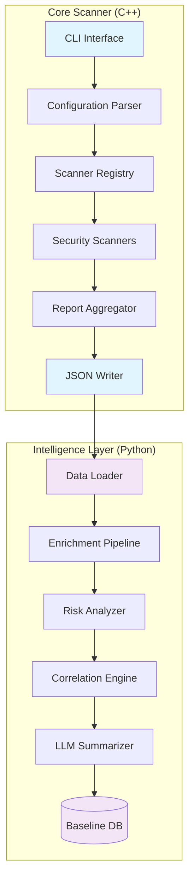

# Architecture Overview

This page provides a high-level overview of the sys-scan-graph architecture, including the separation between the Core Scanner and Intelligence Layer components.

## System Overview

sys-scan-graph is a comprehensive security scanning platform that combines a high-performance C++ core scanner with an intelligent Python-based analysis layer. The system is designed for enterprise security monitoring, compliance assessment, and threat detection.

## Core Components

### Core Scanner (C++)
The Core Scanner is a high-performance, deterministic security scanner written in C++20 that provides the foundation for host-based security assessment.

**Key Characteristics:**
- **Performance**: Single-threaded design optimized for speed and low resource usage
- **Determinism**: Reproducible output ordering and canonical JSON formatting
- **Security**: No external network connections, pure filesystem and procfs enumeration
- **Extensibility**: Plugin-based scanner architecture for easy addition of new security checks

**Responsibilities:**
- Enumerate host security surface (processes, network sockets, kernel parameters, modules, file permissions)
- Perform compliance checks against industry standards (PCI DSS, HIPAA, NIST CSF)
- Generate structured JSON output with stable schema versioning
- Provide minimal policy filtering without complex reasoning

### Intelligence Layer (Python)
The Intelligence Layer consumes raw scanner output and adds advanced analytics, correlations, and AI-powered insights.

**Key Characteristics:**
- **Analytics**: Risk scoring, anomaly detection, and correlation analysis
- **AI/ML**: LLM-powered summarization and threat intelligence
- **Workflow**: LangGraph-based orchestration for complex analysis pipelines
- **Extensibility**: Plugin system for custom rules, knowledge packs, and analysis modules

**Responsibilities:**
- Enrich raw findings with risk assessments and probability scores
- Perform cross-finding correlations and temporal analysis
- Generate executive summaries and actionable remediation guidance
- Maintain baseline databases for anomaly detection
- Provide ATT&CK framework mapping and threat intelligence

## Architecture Diagram



## System Architecture Diagram


*Figure 1: High-level system architecture showing the relationship between Core Scanner and Intelligence Layer components.*

## Data Flow

### Core Scanner Flow
```
CLI Arguments → Configuration → Scanner Registry → Parallel/Sequential Execution
    ↓
Security Findings → Report Aggregation → Canonical JSON Output
```

### Intelligence Layer Flow
```
Raw JSON → Data Validation → Enrichment Pipeline → Risk Analysis
    ↓
Correlation Engine → LLM Summarization → Actionable Insights
```

## Key Design Principles

### Separation of Concerns
- **Core Scanner**: Focuses on raw data collection and basic compliance checks
- **Intelligence Layer**: Focuses on analysis, correlation, and insight generation
- **Clear Interface**: JSON schema provides stable contract between layers

### Determinism & Reproducibility
- **Stable Output**: Consistent ordering and formatting for diffing and caching
- **Canonical Forms**: Environment-variable controlled canonicalization
- **Versioning**: Schema versioning for forward compatibility

### Performance & Scalability
- **Streaming Processing**: Minimal memory footprint through streaming I/O
- **Configurable Limits**: Tunable caps on resource usage (`--max-processes`, `--max-sockets`)
- **Thread Safety**: Mutex-protected data structures for future parallelization

### Security & Privacy
- **No External Calls**: Core scanner operates without network connectivity
- **Redaction**: Intelligence layer applies privacy-preserving data redaction
- **Integrity**: Optional signature verification for configuration files

## Component Interactions

### Core ↔ Intelligence Layer
- **Contract**: Stable JSON schema (v2) with semantic versioning
- **Independence**: Intelligence layer can operate on any compliant JSON input
- **Enhancement**: Intelligence layer adds value without modifying core behavior

### Configuration Management
- **Hierarchical**: Global defaults → User overrides → Environment variables
- **Validation**: Runtime validation of configuration parameters
- **Documentation**: Self-documenting configuration with help text

### Error Handling
- **Graceful Degradation**: Non-fatal errors don't abort scanning
- **Structured Warnings**: Future enhancement for detailed error reporting
- **Logging**: Comprehensive logging with configurable verbosity

## Extensibility Points

### Core Scanner Extensions
1. **New Scanners**: Implement `Scanner` interface in `src/scanners/`
2. **Registration**: Add to `ScannerRegistry::register_all_default()`
3. **Configuration**: Extend configuration schema
4. **Testing**: Add unit tests and integration tests

### Intelligence Layer Extensions
1. **Analysis Modules**: Add new analysis functions to pipeline
2. **Rule Packs**: Extend YAML/JSON rule system
3. **Knowledge Packs**: Add domain-specific knowledge bases
4. **LLM Integrations**: Support additional LLM providers

## Deployment Models

### Standalone Core Scanner
- Deploy C++ binary for minimal footprint scanning
- Suitable for resource-constrained environments
- Output can be processed by external tools

### Full Intelligence Stack
- Deploy both core scanner and intelligence layer
- Enables advanced analytics and AI-powered insights
- Requires Python runtime and dependencies

### Distributed Deployment
- Core scanners on target hosts
- Intelligence layer on central analysis server
- Scalable architecture for large fleets

## Future Evolution

### Planned Enhancements
- **Parallel Execution**: Multi-threaded scanner execution
- **Structured Warnings**: Enhanced error reporting system
- **Plugin Architecture**: Runtime-loadable scanner plugins
- **Performance Profiling**: Built-in performance benchmarking

### Research Directions
- **AI-Native Scanning**: ML-powered scanner optimization
- **Federated Learning**: Privacy-preserving fleet analytics
- **Real-time Monitoring**: Continuous security assessment

## Related Documentation

- **[Core Scanners](Core-Scanners.md)** - Detailed scanner implementations
- **[Intelligence Layer](Intelligence-Layer.md)** - Pipeline and workflow details
- **[Extensibility](Extensibility.md)** - Adding new components
- **[Performance Guide](Performance-Determinism-Provenance.md)** - Optimization and benchmarking

## Quality Assurance & Testing

### Test Coverage

The project maintains comprehensive test coverage across both C++ and Python components:

- **C++ Core Scanner**: High coverage unit tests for all scanner implementations
- **Python Intelligence Layer**: 95.3% pass rate with 131 tests covering graph operations, AI workflows, and data processing
- **Integration Testing**: End-to-end tests validating the complete scanner-to-insights pipeline

### Testing Framework

- **C++ Tests**: CMake/CTest based unit testing for core functionality
- **Python Tests**: pytest framework with asyncio support for async workflows
- **Coverage Analysis**: Automated coverage reporting for both languages

---

*For questions about architecture or design decisions, please see the [Contributing Guide](../../CONTRIBUTING.md) or open a [GitHub Discussion](https://github.com/Mazzlabs/sys-scan-graph/discussions).*


"