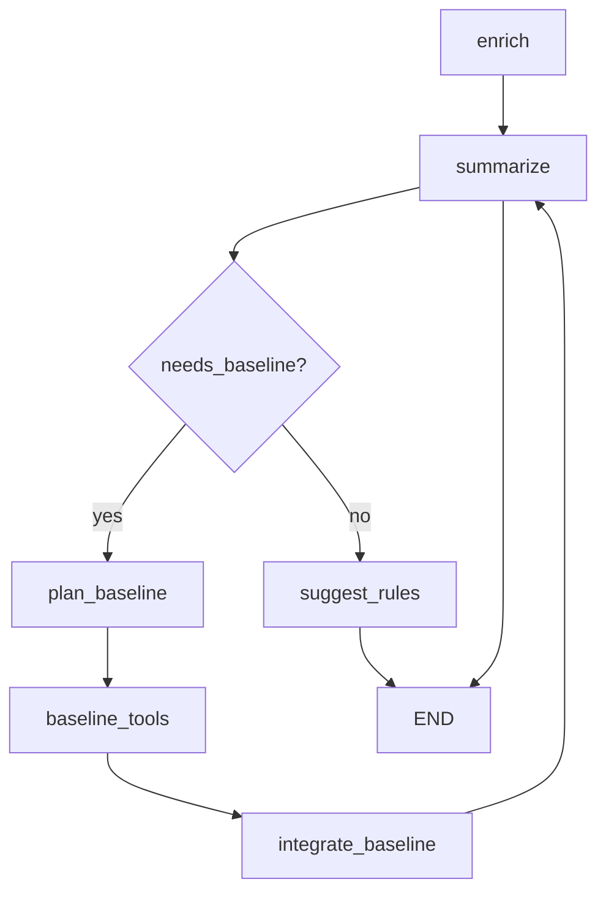
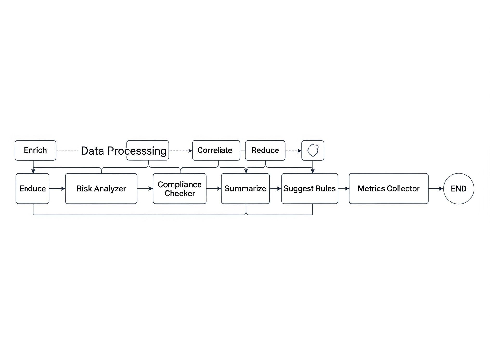

# Intelligence Layer

This page details the Intelligence Layer components of sys-scan-graph, including the pipeline stages, LangGraph orchestration, LLM provider architecture, and data governance features.

## Overview

The Intelligence Layer is a Python-based analysis framework that consumes raw scanner JSON output and produces enriched, actionable security insights. It combines deterministic processing with AI-powered summarization to provide comprehensive threat analysis and remediation guidance.

## Architecture Components

### Core Components

- **Pipeline Engine**: Sequential processing stages for data enrichment
- **LangGraph DAG**: Workflow orchestration with cyclical reasoning
- **LLM Providers**: Configurable AI models for summarization and analysis
- **Data Governance**: Privacy-preserving redaction and compliance
- **Baseline Database**: SQLite-based historical analysis and anomaly detection

### Key Features

- **Deterministic Processing**: Reproducible results under identical inputs
- **Multi-Signal Correlation**: Cross-finding relationship analysis
- **Risk Calibration**: Logistic regression-based probability modeling
- **Temporal Analysis**: Sequence correlation and metric drift detection
- **Fleet Analytics**: Cross-host pattern recognition

## Pipeline Stages

The Intelligence Layer processes data through 15 deterministic stages:

### 1. Load & Validate

- Size and UTF-8 validation guards
- Optional JSON schema validation
- Input sanitization and bounds checking

### 2. Augment

- Host ID and scan ID derivation
- Initial tagging and metadata enrichment
- Host role classification with rationale
- Risk subscore seed generation

### 3. Correlate

- Rule engine processing with exposure bonuses
- Predicate hit tracking for explainability
- External knowledge base tagging
- Multi-finding relationship mapping

### 4. Baseline Rarity

- SQLite database queries for historical context
- New/recent/common classification
- Anomaly weighting based on occurrence patterns
- Calibration observation logging

### 5. Process Novelty

- Lightweight 32-dimensional embedding generation
- Cosine distance clustering for similarity analysis
- Anomaly boost for novel process patterns
- Rationale attachment for escalated findings

### 6. Sequence Correlation

- Temporal heuristics (e.g., new SUID → IP forwarding changes)
- Synthetic correlation finding generation
- Causality hypothesis development

### 7. Metric Drift & Synthetic Findings

- Z-score analysis of performance metrics
- Early delta heuristics for trend detection
- Synthetic drift finding creation
- Regression detection with configurable thresholds

### 8. Multi-Host Correlation

- Simultaneous module emergence detection
- Cross-host propagation analysis
- Fleet-wide pattern recognition

### 9. Reduction

- Module rarity statistics aggregation
- SUID unexpected location summaries
- Network listener consolidation
- Top findings/risks extraction with redaction

### 10. Follow-Ups & Trust

- Deterministic tool execution planning
- Binary hash verification against trusted manifests
- Severity downgrade for known good binaries
- Package manager query integration

### 11. Actions

- Priority-based remediation recommendations
- Correlation-driven action prioritization
- Risk-weighted suggestion ordering

### 12. Summarize

- LLM-powered executive and triage narratives
- Risk-gated summarization to control costs
- Redacted input processing for privacy
- Multi-format output generation

### 13. ATT&CK Coverage & Hypotheses

- MITRE ATT&CK technique mapping
- Coverage metrics and statistics
- Heuristic causal hypothesis generation
- Speculative chain inference with confidence scoring

### 14. Performance & Regression

- Stage timing and counter collection
- Baseline comparison with threshold detection
- Regression flagging and alerting
- Performance telemetry embedding

### 15. Canonicalize & Output

- Stable dictionary key ordering
- Deterministic array sequencing
- SHA256 integrity hashing
- Forward-compatible schema versioning

## LangGraph Orchestration

### Workflow Architecture

The LangGraph implementation provides a bounded enrichment cycle with intelligent routing:



### Workflow Architecture Diagram



*Figure 2: LangGraph DAG implementation showing the bounded enrichment cycle with intelligent routing between enrich, summarize, and baseline processing stages.*

### Workflow Features

- **Bounded Iteration**: `AGENT_MAX_SUMMARY_ITERS` (default: 3) prevents infinite loops
- **Single Baseline Cycle**: `baseline_cycle_done` flag ensures one baseline pass maximum
- **Conditional Routing**: Intelligent path selection based on finding analysis
- **Deterministic Tool Execution**: Structured tool calls via ToolNode integration

### Environment Controls

- `AGENT_MAX_SUMMARY_ITERS`: Maximum summarization iterations
- `AGENT_GRAPH_MODE`: enhanced|baseline mode selection
- `AGENT_KB_REQUIRE_SIGNATURES`: Knowledge file signature enforcement

## LLM Provider Architecture

### Supported Providers

- **OpenAI**: GPT models with configurable parameters
- **Anthropic**: Claude models with safety features
- **Azure OpenAI**: Enterprise-grade model hosting
- **Local Models**: Self-hosted LLM integration

### Configuration Options

```yaml
llm:
  provider: openai|anthropic|azure|local
  model: gpt-4|claude-3|custom
  temperature: 0.1
  max_tokens: 2000
  timeout: 30
```

### Safety & Governance

- **Redaction Pipeline**: Automatic PII removal before LLM processing
- **Risk Gating**: Cost control through risk threshold filtering
- **Token Accounting**: Usage tracking and cost estimation
- **Fallback Handling**: Graceful degradation on provider failures

## Risk & Probability Model

### Risk Subscores

Four-dimensional risk assessment:
- **Impact**: Potential damage severity (1-10)
- **Exposure**: Attack surface exposure (1-10)
- **Anomaly**: Deviation from baseline patterns (1-10)
- **Confidence**: Assessment certainty (0-1)

### Composite Scoring

```python
raw_score = impact*W_i + exposure*W_e + anomaly*W_a
scaled_score = (raw_score / max_raw) * 100 * confidence
probability_actionable = logistic_calibration(raw_score)
```

### Calibration System

- **Logistic Regression**: Maps raw scores to action probabilities
- **Feedback Loop**: Analyst feedback improves calibration
- **Persistent Storage**: Weights and calibration parameters saved to disk

### CLI Management

```bash
# View current weights
python -m agent.cli risk-weights --show

# Update weights
python -m agent.cli risk-weights --impact 6 --exposure 8

# Calibration management
python -m agent.cli risk-calibration --show
python -m agent.cli risk-calibration --a -2.5 --b 0.18
```

## Baseline & Rarity System

### SQLite Database Schema

- **Findings Table**: first_seen, occurrence_counts, severity_history
- **Modules Table**: host-specific presence tracking
- **Metrics Table**: Time-series performance data
- **Calibration Table**: Logistic regression observations
- **Process Clusters**: Embedding vector sums for novelty detection

### Rarity Generation

```bash
# Generate fleet-wide rarity scores
python -m agent.cli rarity-generate-cmd

# Output: rarity.yaml with module rarity rankings
```

### Process Novelty Detection

- **32-Dimension Embedding**: Token hash counts + metadata features
- **Cosine Distance**: Similarity measurement with configurable thresholds
- **Cluster Centroids**: Incremental vector summation for pattern learning
- **Anomaly Boost**: Automatic severity escalation for novel patterns

## Correlation Engine

### Rule-Based Correlations

- **YAML/JSON Rules**: Declarative correlation definitions
- **ANY/ALL Logic**: Flexible condition matching
- **Exposure Bonuses**: Unique exposure tag counting
- **Predicate Tracking**: Explainable correlation reasoning

### Synthetic Correlations

- **Sequence Anomalies**: Temporal pattern detection
- **Multi-Host Propagation**: Simultaneous emergence analysis
- **Metric Drift**: Statistical deviation flagging
- **Causal Hypotheses**: Speculative relationship inference

## Data Governance & Privacy

### Redaction System

- **Filesystem Paths**: User directory sanitization (`/home/user/*`)
- **PII Patterns**: Automatic identification and removal
- **Configurable Rules**: Custom redaction pattern support
- **Audit Trail**: Redaction operation logging

### Privacy Controls

- **Risk Gating**: LLM processing only for high-risk findings
- **Token Limits**: Configurable processing budgets
- **Cost Estimation**: Usage prediction and alerting
- **Compliance Flags**: Regulatory requirement tracking

### Optional Corpus Enrichment

```bash
# Enable corpus insights (local cached datasets)
AGENT_LOAD_HF_CORPUS=1 python -m agent.cli analyze --report report.json
```

```
- Row count summaries
- Schema fingerprints (hashed column sets)
- No raw data exposure
```

## Performance & Determinism

### Telemetry Collection

- **Stage Timing**: Per-operation performance metrics
- **Counter Tracking**: Operation frequency and success rates
- **Memory Usage**: Resource consumption monitoring
- **Error Rates**: Failure pattern analysis

### Regression Detection

- **Baseline Comparison**: Historical performance benchmarking
- **Threshold Configuration**: Configurable regression limits
- **Automated Flagging**: Performance degradation alerts
- **Trend Analysis**: Long-term performance pattern recognition

### Canonicalization

- **Key Sorting**: Deterministic dictionary ordering
- **Array Stability**: Consistent element sequencing
- **Hash Stability**: Reproducible integrity verification
- **Schema Versioning**: Forward-compatible output formats

## Integration Examples

### Basic Enrichment

```bash
python -m agent.cli analyze \
    --report report.json \
    --out enriched.json \
    --graph
```

### Advanced Analysis

```bash
python -m agent.cli analyze \
    --report report.json \
    --checkpoint-dir checkpoints \
    --index-dir runs \
    --graph \
    --out enriched.json
```

### Fleet Analytics

```bash
# Generate fleet-wide insights
python -m agent.cli fleet-report --out fleet.json

# Update rarity database
python -m agent.cli rarity-generate-cmd
```

## Configuration

### Core Configuration (`config.yaml`)

```yaml
agent:
  max_summary_iters: 3
  graph_mode: enhanced
  kb_require_signatures: false

llm:
  provider: openai
  model: gpt-4
  temperature: 0.1

risk:
  weights_file: agent_risk_weights.json
  calibration_file: agent_risk_calibration.json

baseline:
  db_path: baseline.db
  rarity_file: rarity.yaml
```

### Environment Variables

- `AGENT_MAX_SUMMARY_ITERS`: Maximum summarization iterations
- `AGENT_GRAPH_MODE`: enhanced|baseline workflow selection
- `AGENT_KB_REQUIRE_SIGNATURES`: Knowledge file signature enforcement
- `AGENT_LOAD_HF_CORPUS`: Enable corpus enrichment features

## Error Handling & Resilience

### Graceful Degradation

- **Provider Failures**: Fallback to baseline processing
- **Database Issues**: Continue with reduced functionality
- **Memory Limits**: Streaming processing for large datasets
- **Timeout Handling**: Configurable operation timeouts

### Logging & Diagnostics

- **Structured Logging**: JSON-formatted diagnostic output
- **Performance Metrics**: Detailed timing and resource usage
- **Error Context**: Comprehensive failure information
- **Recovery Guidance**: Automated troubleshooting suggestions

## Related Documentation

- **[Architecture](Architecture.md)** - System architecture overview
- **[Rules Engine](Rules-Engine.md)** - Correlation rule configuration
- **[Risk Model](Risk-Model.md)** - Risk assessment and calibration
- **[CLI Guide](CLI-Guide.md)** - Command-line interface usage
- **[Extensibility](Extensibility.md)** - Adding custom analysis components

---

*For questions about the Intelligence Layer implementation or configuration, see the [Contributing Guide](../../CONTRIBUTING.md) or open a [GitHub Discussion](https://github.com/Mazzlabs/sys-scan-graph/discussions).*
