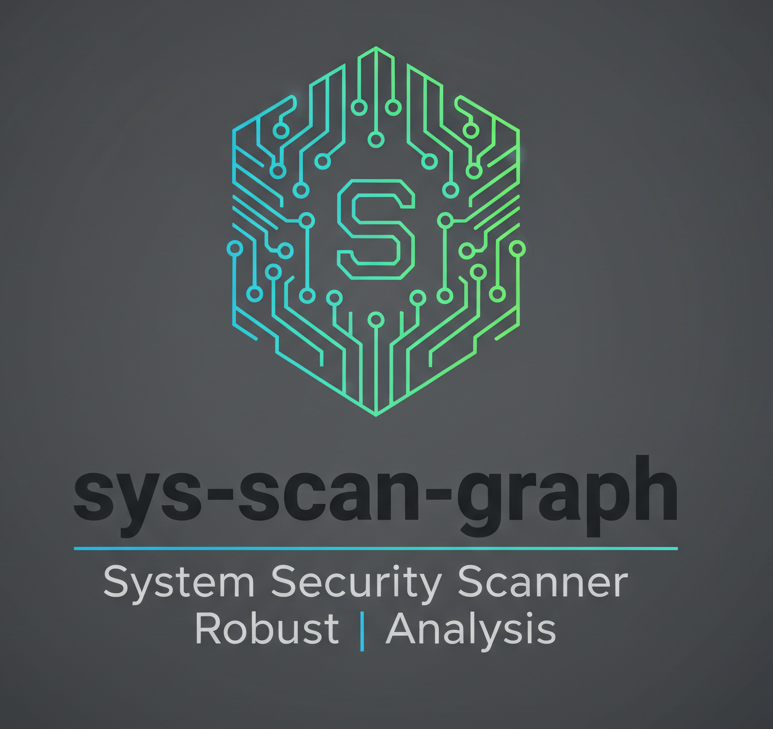

# sys-scan-graph Documentation Index

Authoritative, in-repo documentation for sys-scan-graph — a deterministic, offline-first host security scanner (C++ core) paired with an optional Python intelligence agent for enrichment and triage. Use these pages to find concise guidance for Operators, Developers, and Contributors.

## Quick Links

- **[GitHub Repository](https://github.com/J-mazz/sys-scan-graph)** - Project source and issue tracker
- **[GitHub Wiki](https://github.com/J-mazz/sys-scan-graph/wiki)** - Optional external wiki (may be high-churn)
- **[Issues](https://github.com/J-mazz/sys-scan-graph/issues)** - Report bugs and request features
- **[Discussions](https://github.com/J-mazz/sys-scan-graph/discussions)** - Community Q&A and design conversations

## Core Documentation

- **[Installation Guide](Installation.md)** — how to build and install the core scanner and optional agent
- **[CLI Guide](CLI-Guide.md)** — canonical list of flags and usage examples (core + agent)
- **[Architecture Overview](Architecture.md)** — short, approachable system overview with pointers into the code
- **[Architecture (Technical Details)](Architecture-Technical-Details.md)** — code-backed implementation notes and invariants
- **[Core Scanners](Core-Scanners.md)** — scanner-by-scanner behavior, inputs, and gating flags
- **[Intelligence Layer](Intelligence-Layer.md)** — agent workflows, providers, and outputs

## Features & Components

- **[Rules Engine](Rules-Engine.md)** — correlation rules, linting, and dry-run helpers
- **[Risk Model](Risk-Model.md)** — scoring, calibration, and CLI controls
- **[Extensibility](Extensibility.md)** — how to add scanners, rules, or providers
- **[Interactive UI](Interactive-UI.md)** — design and run notes for the optional Qt/QML dashboard

## Ops & CI

- **[CI Integration](CI-and-SARIF-Integration.md)** — running scans in CI and publishing JSON artifacts
- **[Testing & Coverage](../TEST_COVERAGE.md)** — how to run tests and interpret coverage reports

## Community & Governance

- **[License Overview](License-Overview.md)** — licensing and third-party notices
- **[Contributing Guide](../../CONTRIBUTING.md)** — contribution workflow and expectations
- **[Code of Conduct](../../CODE_OF_CONDUCT.md)** — project behavior guidelines
- **[Security Policy](../../SECURITY.md)** — vulnerability disclosure process

## Quick start (for busy operators)

1. Build core scanner: `cmake -B build -S . -G Ninja -DCMAKE_CXX_STANDARD=23 && cmake --build build -j$(nproc)`
2. Run core scan: `./build/sys-scan --canonical --output report.json`
3. Enrich (optional): `sys-scan-graph analyze --report report.json --out enriched_report.json`

## Support

- File issues on GitHub or start a Discussion for usage questions and proposals.

## License

This documentation is licensed under the Apache License 2.0 (see [`LICENSE`](../../LICENSE)).

---

Last updated: December 24, 2025
